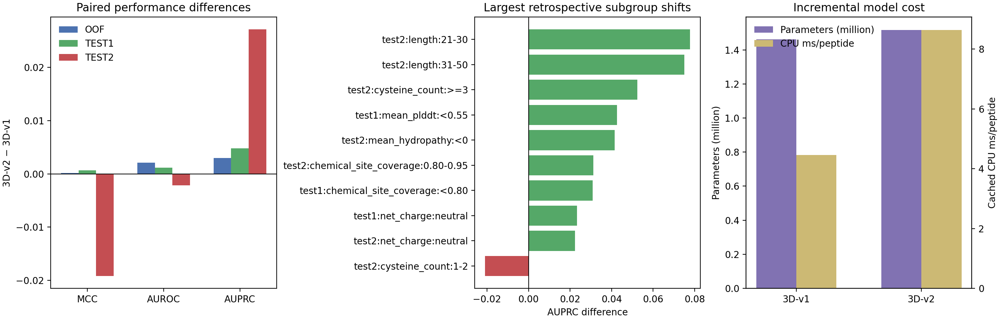

# GHXTox：融合序列与三维化学位点的肽毒性预测

更新时间：2026-07-19
状态：结构创新默认仍为3D-v2；同数据性能候选已更新为三随机种子 pooled ProtT5 + 折内 Borderline-SMOTE TextCNN

## 阅读导航与当前结论

- 项目完整实现了1D序列、2D原子图和3D预测结构三条线路；当前默认模型实际联合使用 **1D序列 + 3D结构** 两个维度。
- 默认3D-v2由ESM2序列Transformer、pLDDT-aware Cα-EGNN和全原子化学位点残差支路组成，OOF阈值为`0.677819`。
- 新论文ToxPLTC路线已完成真实ProtT5验证：三随机种子TextCNN概率平均后，组感知OOF的BACC/MCC/AUROC/AUPRC为`0.9317/0.8586/0.9724/0.9436`，阈值`0.45`只由OOF-BACC平台规则确定。
- 在相同Test1/Test2历史对照上，ProtT5性能候选分别达到BACC/MCC/AUROC/AUPRC `0.9342/0.8598/0.9802/0.9578`和`0.8860/0.6526/0.9588/0.7495`。相对ToxPLTC，Test1全部论文指标超过；Test2灵敏度在论文四位小数上持平`0.8261`，其余指标超过。相对导师ToxMSRC，当前仅Test2 MCC仍低约`0.0024`。
- 另冻结一个不替换主模型的BACC/召回优先操作点：OOF选择ProtT5/ESM2权重`0.64/0.36`和阈值`0.305`，Test1/Test2 BACC提高到`0.9421/0.8993`；但Test2 MCC降至`0.6325`，因此只作为应用侧高召回辅助输出。
- 历史3D-v1 Cα模型保留为无化学位点输入时的自动回退，阈值仍为`0.85`。
- 严格ToxinPred3历史冻结比较中，1D ESM2-BiLSTM的MCC/F1/AUROC/AUPRC均高于2D和3D-v1；3D-v2尚无新的独立外部结论。
- 2D原子图保留为独立对照和化学解释线路；由于它没有在分组验证和已有评估中稳定超过默认3D模型，因此未并入当前分类器。
- 全原子化学位点支路经Pareto checkpoint选择后，在五个训练内同源分组fold上平均MCC/AUROC/AUPRC均为正增益；随后完成8轮全训练集重拟合并成为默认入口。
- 配对统计进一步确认OOF AUROC/AUPRC增益的95%区间均高于0，但OOF MCC、Test1和Test2的MCC增益区间均跨0；当前最可靠的新增证据是训练内排序改善，而不是固定阈值分类显著提升。
- 已完成16条不重复TP/TN/FP/FN案例的序列遮蔽、ESM2积分梯度和化学位点删除归因；这些结果支持个案级模型解释，仍不能代表通用氨基酸毒性规律。
- 本文件是项目唯一 Markdown 说明，模型、结果、进度、命令和论文表述边界均在此维护。

## 摘要

GHXTox 面向肽毒性二分类，使用与导师论文 ToxMSRC 一致的基础数据框架，没有额外引入新的训练数据。项目分别实现并比较三条信息线路：

1. **1D 序列线路**：学习氨基酸顺序、上下文语义和显式理化属性；
2. **2D 原子图线路**：学习原子、化学键及其与残基上下文之间的对应关系；
3. **3D 结构线路**：学习 ESMFold 预测结构中的空间邻域、紧致性和非局部接触，并依据 pLDDT 对不可靠结构信息降权。

当前结构创新默认分类器是 **ESM2 + 序列 Transformer + pLDDT-aware Cα-EGNN + 全原子化学位点交互残差 + learned-confidence fusion** 的3D-v2。这个名称中的“3D”表示它使用三维结构，并不意味着模型只有结构输入；它同时保留了完整的1D序列分支。训练内五折结果显示，化学位点支路相对匹配3D-v1对照带来稳定但幅度较小的排序改善；Test1略有提升，Test2则表现为AUPRC提高、MCC/F1下降。因此，当前更准确的结论是“化学位点有助于部分样本的概率排序”，而不是“3D-v2在所有数据域上都优于旧模型”。

针对“同数据指标超过ToxPLTC”的目标，项目另保留三随机种子的pooled ProtT5 + fold内1:1 Borderline-SMOTE + TextCNN性能候选。它不使用2D或3D输入，优点是无需ESMFold，并且在训练OOF及历史Test1/Test2上形成当前最强的综合决策结果；缺点是尚未在新的预冻结外部集确认，原始FASTA推理还需要先运行ProtT5编码器。两种“默认”必须区分：3D-v2代表结构创新与解释主线，三种子ProtT5代表当前同数据性能上限候选。

本文档把结论分为三个证据等级：

- **已实现并验证**：可以由源码、配置、冻结指标或输出文件直接确认；
- **模型支持的生物学解释**：说明模型使用了哪些与生物化学相关的信号，但不等同于实验因果机制；
- **待验证假说**：需要扩大解释样本、独立数据或湿实验后才能形成生物学结论。

---

## 1. 任务、数据与证据边界

### 1.1 任务定义

输入为线性、标准氨基酸字母表示的肽序列，输出为毒性概率：

\[
p(y=1\mid x)=\sigma(z),
\]

其中 \(x\) 为肽序列及可用的 2D/3D 表征，\(z\) 为分类器 logit，\(y=1\) 表示毒性肽。当前任务是**总体毒性二分类**，不是毒性类型、靶器官、作用机制或剂量-反应预测。

### 1.2 数据组成

当前基础数据与导师论文 ToxMSRC 对应：

| 数据集 | 毒性肽 | 非毒性肽 | 总数 | 当前用途 |
| --- | ---: | ---: | ---: | --- |
| Train | 1818 | 4569 | 6387 | 模型训练与组感知验证 |
| Test1 | 320 | 806 | 1126 | 历史对照 |
| Test2 | 46 | 536 | 582 | 历史对照，正样本很少 |
| ToxinPred3 strict external | 471 | 506 | 977 | 冻结外部迁移评估 |

ToxinPred3 严格外部集经过精确去重和相对当前 Train/Test1/Test2 的 `>=0.8` 同源筛查；原生 CD-HIT 4.8.1 复核确认当前 977 条是更保守的子集。**这些外部样本没有加入训练集，模型参数和阈值也没有根据其标签重新调整。**

### 1.3 评估边界

Test1/Test2 在历史开发中已被多次查看，因此可用于复现和横向历史比较，但不再适合支持新的架构选择或无偏创新主张。3D-v2的模型筛选主要依赖组间同源隔离的group-aware CV和OOF配对统计。ToxinPred3 strict提供历史1D/2D/3D-v1的冻结迁移证据；因为其标签已被查看，不再用它为3D-v2形成新的独立外部主张。

Test2 只有 46 个正样本，少量 TP/FN 的变化即可明显改变召回率、F1 和 MCC。因此，Test2 的小数点后微小差异不能脱离多随机种子方差和置信区间解释。

### 1.4 ToxinPred3 在本项目中的作用、增益与预测支持

#### 1.4.1 核心定位

ToxinPred3 在 GHXTox 中是**严格低同源外部压力测试集**，不是训练数据、模型输入分支或集成专家。它用于回答：当模型、checkpoint 和阈值全部冻结后，1D、2D、3D 三条线路面对另一个数据库来源的肽序列时，是否仍能保持排序、分类和概率可靠性。

| 作用 | ToxinPred3 是否承担 | 具体说明 |
| --- | --- | --- |
| 扩充训练集 | 否 | 471 条毒性肽和 506 条非毒性肽均未加入训练 |
| 模型微调 | 否 | 不更新任何神经网络参数 |
| checkpoint/架构选择 | 否 | 评估前已经冻结 1D、2D、3D 模型 |
| 阈值选择 | 否 | 继续使用1D `0.50`、2D `0.25`、历史3D-v1 `0.85` |
| 外部泛化验证 | 是 | 检查跨数据库和低同源条件下的性能 |
| 外部概率校准检查 | 是 | 报告 Brier 和 ECE-10，但不据此重新校准 |
| 三线路迁移比较 | 是 | 比较序列、原子拓扑和预测结构的跨域稳定性 |
| 部署策略支持 | 是 | 为保留 1D 回退、报告结构质量和处理线路冲突提供证据 |
| 生物学解释外部复核 | 可以 | 仅能在冻结模型上做 TP/TN/FP/FN 分层，不可反向调参 |

ToxinPred3 不会出现在单条样本的前向计算中。模型预测仍然只依赖该样本的序列、ESM2 表征以及相应线路需要的原子图或 ESMFold 结构。ToxinPred3 不提供额外特征、相似样本投票或概率加成，所以它带来的不是“模型数值性能增益”，而是“结果证据和使用策略增益”。

#### 1.4.2 严格集构建和独立性

项目使用 ToxinPred3 官方独立测试来源，先相对当前 Train、Test1、Test2 的完整序列集合执行精确去重，再删除序列一致性 `>=0.8` 的同源样本。筛查后保留 977 条：

| 类别 | 数量 |
| --- | ---: |
| 毒性肽 | 471 |
| 非毒性肽 | 506 |
| 总计 | 977 |

原生 CD-HIT 4.8.1 复核保留 987 条，当前 977 条全部包含在原生结果中；另外 10 条仅被原生方法保留。因此，当前集合是一个更保守的、已经过原生 CD-HIT 验证的外部子集。ToxinPred3 的训练文件只参与重叠审计，不进入 GHXTox 训练。

关键文件：

- `data/external/toxinpred3/strict/strict.fasta`：严格外部序列；
- `data/external/toxinpred3/strict/strict_manifest.csv`：样本、标签与筛查清单；
- `data/external/toxinpred3/strict/audit_summary.json`：去重和同源审计摘要；
- `data/external/toxinpred3/cdhit_audit/native_cdhit_audit.json`：原生 CD-HIT 复核；
- `data/external/toxinpred3/processed/strict_esm2_structure.pt`：冻结 3D 评估数据；
- `runs/external_toxinpred3_1d/`、`runs/external_toxinpred3_2d/`、`runs/external_toxinpred3_3d/`：预测与指标。

#### 1.4.3 对预测结果的直接证据

三条线路均使用训练/验证阶段已经确定的固定阈值，一次性外部评估结果为：

| 路线 | BACC | Precision | Recall | F1 | MCC | AUROC | AUPRC | Brier | ECE-10 |
| --- | ---: | ---: | ---: | ---: | ---: | ---: | ---: | ---: | ---: |
| 1D ESM2-BiLSTM | **0.7780** | 0.8885 | **0.6299** | **0.7369** | **0.5859** | **0.8266** | **0.8673** | **0.1745** | **0.1301** |
| 2D ESM2 + Atom-MPNN | 0.7540 | 0.8911 | 0.5732 | 0.6977 | 0.5488 | 0.7786 | 0.8373 | 0.2160 | 0.2031 |
| 历史3D-v1 pLDDT-aware模型 | 0.7484 | **0.9162** | 0.5428 | 0.6815 | 0.5495 | 0.7629 | 0.8271 | 0.2260 | 0.2208 |

这些结果对预测结论提供了四层支持：

1. **支持 1D 的跨域稳定性。** 1D 的 MCC、F1、AUROC、AUPRC、Brier 和 ECE 均最好，说明不依赖预测结构的 ESM2-BiLSTM 在该外部域上迁移更稳健。
2. **限定历史3D-v1增益的适用范围。** 它在历史Test1/Test2上曾是默认决策模型，但外部MCC/AUPRC没有超过1D，说明结构信息的同域收益没有完整迁移到ToxinPred3。
3. **揭示 3D 的保守预测倾向。** 3D precision 为 0.9162、recall 为 0.5428：一旦报毒通常较可靠，但约 45.7% 的外部毒性肽未达到 0.85 阈值。
4. **揭示概率可靠度偏移。** 2D/3D 的 Brier 和 ECE 明显高于 1D，说明复杂线路在新数据域中的概率置信度发生偏移，不能把域内校准直接当作域外可靠度。

因此，ToxinPred3不支持“3D对所有数据都最好”，而支持更精确的结论：**历史3D-v1具有同域决策优势，1D是该严格外部域中最稳定的迁移和无结构回退模型；3D-v2尚无新的外部集结论。**

#### 1.4.4 ToxinPred3 带来的项目增益

ToxinPred3 没有改变模型参数，所以不能把它描述为训练增益或准确率提升。它带来的实际增益是：

- **独立性增益**：补足 Test1/Test2 已被历史开发多次观察的不足；
- **同源控制增益**：降低因重复或高相似序列造成的性能高估；
- **模型定位增益**：把“默认 3D”修正为条件性最优，而不是普遍最优；
- **部署增益**：为保留 1D 正式回退、结构低可信时降低 3D 依赖提供实证依据；
- **风险识别增益**：识别 3D 高 precision/低 recall 的外部漏检风险；
- **校准证据增益**：证明 OOF 或历史测试域的可靠度不能自动迁移到外部域；
- **论文可信度增益**：可以同时报告正结果、外部退化和模型适用边界，减少选择性报告；
- **解释验证增益**：允许检查残基热点和错误模式是否跨数据源稳定，而不是只解释同域样本。

#### 1.4.5 对实际预测使用的支持方式

ToxinPred3 结果支持以下预测策略，但不直接改变单条样本概率：

| 使用场景 | 建议 |
| --- | --- |
| 有全原子ESMFold缓存、样本接近训练域 | 使用默认3D-v2，同时报告pLDDT |
| 只有Cα/旧NPZ缓存 | 自动回退3D-v1并标记`fallback_used=1` |
| 无结构、结构生成失败或平均 pLDDT 较低 | 使用 1D ESM2-BiLSTM 回退 |
| 未知数据库或明显分布偏移 | 同时报告 1D/3D 概率、pLDDT 和跨种子不确定性 |
| 1D 与 3D 判断一致 | 作为跨线路一致性支持，但仍不是实验真实性证明 |
| 1D 与 3D 判断冲突 | 标记为高风险样本，不应因 3D 更复杂就自动采信 3D |
| 3D 高概率报毒 | 外部高 precision 提供一定支持，但不能外推为精确的个体后验概率 |
| 3D 低于 0.85 | 不能直接判定安全，因为外部 recall 只有 0.5428，应参考 1D 和人工复核 |

ToxinPred3 最重要的预测支持不是提高某一条预测，而是帮助解释“该预测在什么条件下更可信、什么时候应回退或谨慎”。

#### 1.4.6 后续使用边界

ToxinPred3 的标签和结果现已被查看，因此它不再能用于下一轮无偏模型选择。该数据仍可用于：

- 作为冻结结果的最终报告集；
- 进行不改变模型的 TP/TN/FP/FN 错误分析；
- 进行冻结残基解释和跨数据集稳定性分析；
- 报告 bootstrap 区间、校准和线路差异。

该数据不再适合用于：

- 根据 ToxinPred3 调整 1D/2D/3D 阈值；
- 反复修改架构直到该集合性能提高；
- 使用其标签训练路由器、校准器或残差专家；
- 把其样本加入当前训练集后仍称为独立外部验证；
- 仅凭这一个外部来源宣称跨数据库普遍泛化。

新的泛化或校准创新需要第二个独立数据来源验证。

---

## 2. 项目实现的三个维度与当前默认用法

“项目实现了几个维度”和“默认模型实际使用几个维度”是两个不同问题。项目层面已经完成1D、2D、3D三条独立线路；当前默认3D-v2联合使用1D和3D，共两个维度。

| 维度 | 项目是否实现 | 默认3D-v2是否使用 | 当前作用 |
| --- | --- | --- | --- |
| 1D序列 | 是 | **是** | ESM2和序列Transformer提供残基上下文；独立ESM2-BiLSTM还承担无结构回退 |
| 2D原子图 | 是 | **否** | Atom-MPNN用于检验共价拓扑和局部原子化学，保留为对照与解释专家 |
| 3D预测结构 | 是 | **是** | Cα-EGNN学习空间邻域，全原子化学位点支路补充侧链类型、距离和方向 |

2D没有并入默认模型，主要有三个原因。第一，最佳2D模型虽证明原子拓扑具有互补信息，但在Test1、Test2和严格ToxinPred3冻结比较中都没有稳定超过相应保留模型。第二，把2D作为小残差叠加到3D主干后，Test2 MCC/F1下降，说明简单三维度堆叠会带来冗余或过拟合。第三，2D图由线性肽序列确定性生成，无法表示真实非共价空间关系，而当前创新的核心正是三维位点之间的距离和方向。

需要特别区分：**全原子化学位点支路仍属于3D维度**。它使用PDB中的三维坐标、方向向量、原始距离和尺度归一化距离；它不读取RDKit共价键图，所以不应将其计为默认模型中的2D线路。

```text
肽序列
  |
  +-- 共同残基输入
  |     +-- 氨基酸类别嵌入（32D）
  |     +-- 官能团类别嵌入（12D）
  |     +-- 显式残基理化描述符（42D）
  |     +-- ESM2-650M 上下文残基向量（1280D -> 128D）
  |     +-- 全局特征：长度、净电荷、芳香族比例、Cys 比例、平均疏水性
  |
  +-- 1D：BiLSTM -> mean/max pooling -> MLP
  |
  +-- 2D：序列 Transformer <-> Atom-MPNN 残基对齐双向跨注意力
  |        -> mean pooling -> MLP
  |
  +-- 3D：序列 Transformer + pLDDT-aware Cα-EGNN
           + 全原子化学位点方向/距离残差
           -> 残基级门控 + 全局结构门控 + 跨注意力
           -> mean pooling -> MLP
```

三条线路都以残基为对齐单位，但它们回答的问题不同：1D关注序列语义和排列，2D关注共价键连接的局部化学，3D关注序列上可能相距很远的残基在空间中是否靠近。当前3D分支也接收ESM2表征，因此更准确的名称是 **PLM-enhanced geometric branch**，而不是纯几何模型。

共同的 42 维显式残基特征覆盖：疏水性、形式化电荷类别、极性、芳香性、含硫性、正/负电类别、转角倾向、相对分子量、长度为 5 的局部窗口电荷/疏水性/官能团比例、相对位置、N/C 端倾向、脂肪族/支链/小残基类别、G/P/C/M 标记、羟基/酰胺/羧酸盐/伯胺/胍基/咪唑/酚/吲哚等官能团，以及由序列构造的理化关联图社区编号、社区比例和加权度。它们使模型可以直接访问可解释的理化信号，但这些人工描述符仍是序列派生量，不是实验测量值。

---

## 3. 1D 序列线路：默认模型的序列基础与无结构回退

### 3.1 实际保留的架构

默认3D-v2内部的1D分支是两层序列Transformer；另外，项目保留了一个可独立部署的ESM2-BiLSTM，用于没有可用结构或出现明显域偏移的情况。冻结回退配置见 [`configs/sequence_1d_bilstm.json`](configs/sequence_1d_bilstm.json)，其架构为：

```text
[AA embedding 32D;
 functional-group embedding 12D;
 residue descriptors 42D;
 projected ESM2 128D]
             |
       Linear -> 128D
             |
     positional embedding
             |
   1-layer bidirectional LSTM
   (64D forward + 64D backward)
             |
 masked mean pooling + masked max pooling
             |
      256D peptide vector
             + 5D global features
             |
        MLP: 261 -> 128 -> 64 -> 1
```

代码仍保留核大小3/5/7的多尺度CNN和残差连接，便于复现对照实验；冻结配置中`sequence_use_multiscale=false`、`sequence_use_residual=false`，实际使用的是BiLSTM。多尺度CNN没有在分组验证中稳定超过ESM2-BiLSTM，因此它属于已完成的对照，而非当前模型组成。

训练采用类别自动加权的 BCE，不使用 SMOTE。模型固定阈值为 `0.50`，用于当前 1D 冻结评估。

### 3.2 每一层可对应的生物学含义

#### 氨基酸与官能团嵌入

氨基酸身份决定侧链大小、极性、电离状态、芳香性和构象倾向。官能团类别嵌入进一步把化学性质相近的残基放在可学习空间中。例如 Lys/Arg 的正电性质、Asp/Glu 的负电性质、Phe/Tyr/Trp 的芳香性、Cys/Met 的含硫属性可被模型显式区分。

这条支路支持的解释是：模型能够学习“哪些残基类型及其组合与训练标签相关”。它不直接证明某个残基通过某种受体或膜破坏机制导致毒性。

#### 42 维理化描述符

显式电荷和局部电荷密度可以表示阳离子簇；疏水性和芳香族比例可以表示可能参与膜分配或疏水核心形成的序列片段；Cys 可提示潜在二硫键稳定性；Gly/Pro 与局部柔性和转角倾向相关；N/C 端位置特征允许模型区分相同残基出现在肽链不同位置时的统计作用。

这些关系是合理的生物化学先验，但模型只看到序列派生描述符。比如“正电且疏水”可以与膜活性相关，却不能据此断言样本一定通过细胞膜裂解致毒。

#### ESM2 上下文表示

ESM2-650M 为每个残基提供 1280 维上下文向量，再投影到 128 维。该向量不是单纯的氨基酸类别，而是依赖整条序列的上下文表示，因此同一个 Lys 出现在不同基序、不同端部和不同长程背景时可得到不同表示。

它可以补充人工特征难以穷举的高阶序列模式，例如：

- 带电残基与疏水残基的间隔和组合；
- Cys 的上下文及可能的成对模式；
- 局部基序与远端残基的共同出现；
- 类似已知肽家族的统计“序列语法”。

但 ESM2 表示来自大规模蛋白序列预训练，不能直接等价为毒性机制知识。

#### BiLSTM 与双向依赖

前向 LSTM 按 N 端到 C 端整合信息，后向 LSTM按 C 端到 N 端整合信息。双向输出允许一个残基的表示同时受其上游和下游序列影响，适合描述端部效应、局部片段与远端背景之间的顺序依赖。

BiLSTM 的生物学意义不是模拟肽的物理动力学，而是学习**有方向的序列统计依赖**。它比简单残基计数更能区分组成相近但排列不同的肽。

#### mean/max pooling 与全局描述符

mean pooling 概括全序列的平均模式，max pooling 捕捉最强的局部激活。因此，1D 模型可以同时利用“整体组成倾向”和“少数强基序”。长度、净电荷、芳香族比例、Cys 比例和平均疏水性作为 5 个全局特征直接进入分类器，减少模型必须从局部向量重新推导这些总量的负担。

### 3.3 1D 线路的可解释范围与边界

**可以解释：**

- 哪些序列位置对某一预测起促进或抑制作用；
- 模型是否依赖带电、疏水、芳香、含硫或端部等序列信号；
- 不同随机种子是否对关键位置形成一致判断；
- 无结构场景下，序列信息能否稳定迁移。

**需要结构或实验证据才能进一步解释：**

- 肽在溶液中的真实构象；
- 残基之间是否形成真实空间接触或氢键；
- 二硫键具体配对、质子化微状态和膜结合姿态；
- 具体毒性靶点、剂量和实验因果机制。

### 3.4 当前证据

1D 三随机种子结果为：

| 数据集 | F1 | MCC | AUROC | AUPRC |
| --- | ---: | ---: | ---: | ---: |
| Test1 | 0.8768 ± 0.0039 | 0.8285 ± 0.0036 | 0.9709 ± 0.0021 | 0.9432 ± 0.0032 |
| Test2 | 0.6051 ± 0.0182 | 0.5773 ± 0.0222 | 0.9361 ± 0.0122 | 0.6965 ± 0.0178 |
| ToxinPred3 strict | 0.7369 | **0.5859** | **0.8266** | **0.8673** |

在严格ToxinPred3冻结评估上，1D的MCC、F1、AUROC和AUPRC均高于历史2D和3D-v1。这说明当结构质量或数据域发生变化时，ESM2-BiLSTM学到的序列信号可能更稳健。该结果支持把1D定义为正式部署回退线路，而不只是“去掉结构的消融”。3D-v2尚无新的独立外部评估结论。

---

## 4. 2D 原子图线路：已完成的化学对照，未并入默认模型

### 4.1 实际保留的架构

冻结2D配置见 [`configs/plm_sequence_atom_cross_attention.json`](configs/plm_sequence_atom_cross_attention.json)。这条线路的价值在于回答“共价拓扑和局部原子化学是否能补充序列信息”，而不是为了在默认模型中强行集齐三个维度。架构由两个分支和双向跨注意力组成：

```text
序列分支：
AA/group/42D/ESM2 -> 128D -> 2-layer Transformer (4 heads)
                              |
                              | sequence queries atom residues
                              | atom residues query sequence
                              v
原子分支：
RDKit MolFromSequence
 -> atom features 30D + bond features 11D
 -> 3-layer residual Atom-MPNN (hidden 128D)
 -> attention pooling of atoms within each residue
 -> residue-aligned atom representation
                              |
                  concatenate two 128D residue views
                              |
                       masked mean pooling
                              |
                   + 5D global features -> MLP
```

序列 Transformer 使用两层、四头自注意力，以学习全局上下文。原子图由 RDKit 根据标准线性肽序列确定性构建。每个化学键被展开为两个方向的消息传递边。

### 4.2 原子和化学键具体表示

基础原子节点为 30 维，包含：

- 元素类型：C、N、O、S、P 或其他；
- 原子度数和形式电荷；
- `sp`、`sp2`、`sp3` 或其他杂化类型；
- 芳香性、环属性和手性标签；
- 主链原子身份：N、CA、C、O 或侧链；
- 所属残基的归一化位置；
- Gasteiger 部分电荷。

化学键边为 11 维，包含：

- 单键、双键、三键、芳香键；
- 共轭和成环属性；
- 是否为相邻残基间的肽键；
- 键立体信息。

三层 Atom-MPNN 让每个原子逐层接收邻近原子和化学键信息。随后在同一残基内部进行注意力聚合，把数量不等的原子压缩成与序列位置一一对应的残基级原子表示。

### 4.3 生物学解释线路

#### 局部化学环境

原子图比“氨基酸字母”更直接地表达羰基、胺基、硫原子、芳香体系、形式/部分电荷和共轭结构。消息传递可把单个原子属性与其邻域结合，从而区别相同元素处于不同化学环境中的含义。

因此，2D 模型可以支持以下层面的解释：

- 哪些残基的原子组成和局部键环境与预测相关；
- 模型是否偏向带电、芳香、含硫或特殊主链环境；
- 原子化学表征是否为单纯序列表征提供互补信息。

#### 残基内原子注意力池化

同一残基的不同原子对功能贡献并不等价。注意力池化允许模型对主链、侧链或特定杂原子赋予不同权重，然后将其对齐到对应残基位置。这一步建立了“原子化学—残基序列”的桥梁。

注意力权重反映模型在当前前向计算中如何聚合信息，但不等价于因果重要性。论文级解释应与遮蔽、反事实突变或梯度归因联合使用，不能只展示注意力热图。

#### 双向跨注意力

序列查询原子表示回答“当前上下文残基需要读取哪些局部化学信息”；原子表示查询序列回答“当前化学环境应结合哪些序列背景理解”。双向对齐使模型可以区分：

- 化学组成相似、但序列上下文不同的残基；
- 序列位置相似、但侧链原子和键环境不同的残基；
- 局部原子属性与长程序列语义共同出现的模式。

### 4.4 2D 线路的边界

当前原子图是 `RDKit Chem.MolFromSequence` 产生的**确定性二维共价拓扑图**，不是实验结构，也不是分子动力学构象。因此它不能表示：

- 溶剂、离子、pH 和真实质子化微状态；
- 非共价空间接触、氢键距离和膜结合构象；
- 未在输入中编码的环肽、非天然氨基酸和翻译后修饰；
- 真实二硫键配对及多构象动态。

### 4.5 当前证据

最佳 2D 单检查点 ESM2 + Atom-MPNN cross-attention 的结果为：

| 数据集 | F1 | MCC | AUROC | AUPRC |
| --- | ---: | ---: | ---: | ---: |
| Test1 | 0.8781 | 0.8297 | 0.9719 | 0.9311 |
| Test2 | 0.6429 | 0.6183 | 0.9336 | 0.6622 |
| ToxinPred3 strict | 0.6977 | 0.5488 | 0.7786 | 0.8373 |

2D明显优于atom-graph-only分支，说明“原子化学需要和残基上下文对齐”是有效的。但它没有在已有评估中稳定超过3D主干，严格ToxinPred3上也低于1D回退模型。此外，小权重地将原子图残差叠加到3D后，Test2 MCC由0.6320降至0.5728。这些结果说明2D是有用的化学对照，但当前没有足够证据让它进入默认分类器。

---

## 5. 3D 结构线路：当前默认的1D+3D联合模型

### 5.1 实际保留的架构

当前默认配置见 [`configs/default.json`](configs/default.json)。它在原3D-v1主干之外增加化学位点残差支路：

```text
序列分支
AA/group/42D/ESM2 -> 128D -> 2-layer Transformer, 4 heads
                                            |
                                            | query
                                            v
空间分支                              pLDDT-aware cross-attention
42D/16D geometry/pLDDT/ESM2                 ^
 -> hybrid graph                            | gated key/value
 -> 3 pLDDT-aware EGNN layers               |
 -> Cα spatial residue representations -----+
             ^
             |
全原子化学位点图
双位点/方向/双尺度RBF/相互作用类型/pLDDT
 -> 2-layer site message passing
 -> zero-initialized residue residual -------+
                                            |
                node gate × global graph gate
                                            |
       concatenate(sequence, gated spatial context)
                                            |
                  masked mean pooling
                                            |
                 + 5D global features
                                            |
                    MLP -> logit
```

序列分支与2D路线相同，使用ESM2增强的两层Transformer。Cα空间主干输入ESMFold预测的Cα坐标、逐残基pLDDT、42维残基属性、16维几何描述符以及ESM2表征，再通过三层等变图消息传递更新残基状态和坐标。化学位点支路从全原子PDB提取侧链功能中心，以零初始化残差写入Cα空间表示；缺少化学位点张量时，默认推理入口自动加载历史3D-v1 checkpoint，而不是用全零位点冒充完整3D-v2。

### 5.2 16 维几何描述符

当前冻结模型实际使用的 16 维 Cα 几何特征为：

1. 当前残基 pLDDT；
2. 低置信标记（pLDDT < 0.55）；
3. 局部窗口 pLDDT 均值；
4. 局部窗口 pLDDT 最小值；
5. 到肽几何中心的归一化径向距离；
6. 6 Å 内接触密度；
7. 8 Å 内接触密度；
8. 10 Å 内接触密度；
9. 指数衰减软接触密度；
10. 近邻平均距离；
11. 最近非局部残基距离；
12. 相邻主链距离；
13. 局部夹角余弦；
14. 局部二面角正弦；
15. 局部二面角余弦；
16. 长度缩放的径向位置。

这些量描述的是预测 Cα 骨架的紧致性、局部弯折、空间中心/表面倾向和序列远隔残基是否靠近。它们没有显式给出完整侧链取向、氢键、溶剂可及面积或静电势。

### 5.3 混合图和边表示

残基作为节点。混合图同时保留：

- 序列相邻边，保证主链连续信息可传播；
- 每个残基的空间 top-10 近邻边，捕获折叠后靠近但序列上可能远隔的残基。

边表示包括 16 个径向基函数距离通道、成对 pLDDT 置信度和序列间隔。空间距离越远，消息通过 `exp(-distance/12)` 衰减；成对置信度近似为两个残基 pLDDT 乘积的平方根，再以幂次 1.5 映射到边权。当前最低边权保留为 0.1，因此低 pLDDT 边被降权而不是完全删除。

### 5.4 pLDDT-aware EGNN

EGNN 在不依赖任意坐标轴方向的前提下，根据节点表征、成对距离和边特征传递信息。旋转或平移输入坐标不应改变毒性判断的物理含义，这比直接把 x/y/z 坐标当普通数值更合理。

每层主要完成：

1. 根据两个残基状态、距离 RBF、成对置信度和序列间隔生成消息；
2. 用图连接、距离衰减和 pLDDT 权重调节消息强度；
3. 聚合邻域消息更新残基表征；
4. 用较小系数更新相对坐标，并重新中心化。

训练时加入标准差 0.12 的坐标扰动，低 pLDDT 位置扰动更强。这相当于告诉模型：对预测不稳定的结构细节不应过度拟合。

### 5.5 两级置信门控与跨注意力

当前 `learned_confidence` 融合不是简单把 1D 和 3D 向量相加，而是设置两个层次的结构使用量：

#### 残基级门控

每个位置的门控由残基理化特征、该位置 pLDDT、pLDDT 相对中心值、平方项和低置信标记共同决定。空间表示先乘残基门控，再作为跨注意力的 key/value。其含义是：模型可以在同一条肽内更多使用高可信结构区域，减少低可信区域的影响。

#### 全局结构门控

整条肽的门控使用平均 pLDDT、最小 pLDDT 和低置信残基比例。跨注意力输出再乘全局门控后与序列表示拼接。其含义是：当整条预测结构整体不稳定时，模型可退回更多序列信息，而不是强制相信 3D。

重要限定：**pLDDT 是结构预测模型的置信度，不是肽自身的生物活性属性。**低 pLDDT 可能来自真实柔性，也可能来自 ESMFold 对短肽缺乏信息；不能把“低 pLDDT”直接解释成“更柔性”“更无序”或“更无毒”。

### 5.6 3D 生物学解释线路

3D 模型能够提出但尚不能直接证明的机制相关假说包括：

- 高接触密度与短非局部距离可能对应更紧致的构象；
- 序列远隔残基在空间上靠近时，模型可以学习协同的局部表面模式；
- 电荷/疏水残基的空间聚集可能比单纯序列组成更有判别力；
- 某些局部弯折或端部靠近模式可能与稳定性、膜接触面或靶标结合倾向相关。

这些只能表述为“模型利用的结构统计关联”或“可供实验验证的机制假说”。仅凭 ESMFold Cα 结构不能声称发现了真实结合口袋、氢键网络、膜插入角度或受体相互作用。

### 5.7 当前默认3D-v2与历史3D-v1

3D-v2使用五折OOF选择的阈值`0.677819`；3D-v1历史结果使用阈值`0.85`：

| 数据集 | 模型 | BACC | F1 | MCC | AUROC | AUPRC |
| --- | --- | ---: | ---: | ---: | ---: | ---: |
| Test1 | 历史3D-v1 | 0.9179 | 0.8885 | 0.8458 | 0.9699 | 0.9426 |
| Test1 | 当前默认3D-v2 | 0.9208 | 0.8896 | 0.8464 | 0.9711 | 0.9474 |
| Test2 | 历史3D-v1 | 0.8481 | 0.6602 | 0.6320 | 0.9316 | 0.6969 |
| Test2 | 当前默认3D-v2 | 0.8453 | 0.6415 | 0.6128 | 0.9295 | 0.7241 |

Test1上3D-v2的MCC提高`+0.0007`、AUPRC提高`+0.0048`；Test2上AUPRC提高`+0.0272`，但MCC降低`-0.0192`。因此默认升级代表项目优先保留训练内五折一致增益和正类概率排序改善，不代表所有历史测试决策指标全面提高。

三随机种子均值：

| 数据集 | F1 | MCC | AUROC | AUPRC |
| --- | ---: | ---: | ---: | ---: |
| Test1 | 0.8678 ± 0.0213 | 0.8195 ± 0.0276 | 0.9669 ± 0.0027 | 0.9336 ± 0.0079 |
| Test2 | 0.6119 ± 0.0449 | 0.5782 ± 0.0499 | 0.9225 ± 0.0099 | 0.6356 ± 0.0557 |

历史3D-v1的高pLDDT测试子集性能明显更高：Test1 MCC从0.8458升至0.8878，Test2 MCC从0.6320升至0.7221。但只用高pLDDT样本训练会降低完整测试域性能，所以当前3D-v2继续采用连续降权和门控，而不是硬删除低置信样本。

ToxinPred3 strict上的历史3D-v1 precision为0.9162、recall为0.5428、MCC为0.5495，表现出很强的保守预测倾向。3D-v2是在查看该外部集之后才完成的，因此不再对同一外部标签追加默认升级评估；新的跨域结论必须来自新独立数据。

### 5.8 化学位点—方向—连续多尺度相互作用图创新尝试

#### 5.8.1 数据基础与默认模型边界

2026-07-16 获得了覆盖 Train、Test1、Test2 和 ToxinPred3 strict 的 ESMFold 全原子 PDB：分别为 6,387、1,126、582 和 977 条，共 9,072 条。压缩包 SHA-256 已核对一致。包内旧格式 NPZ 仍只包含 `coords`、`plddt`、`backbone_coords`、`backbone_mask`、`sequence` 和 `source_pdb`，化学位点必须从保留的全原子 PDB 重新解析。

旧单中心解析在274,141个残基中得到178,795个有效中心，覆盖率为65.22%。最终训练缓存加入脂肪族疏水位点，并把Tyr/Trp等多功能侧链拆为两个位点：训练集201,994个残基中，186,263个残基至少有一个位点，覆盖率提高到92.21%，共得到195,031个位点。Test1/Test2化学位点覆盖率为92.09%和92.28%。**该支路现已融入默认3D-v2；原Cα-only 3D-v1保留为输入不完整时的自动回退。**

#### 5.8.2 第一轮：单中心、多锚点和固定双尺度图

第一轮把每个残基压缩成一个官能团几何中心，计算其相对本残基 Cα、N 端 Cα、全链 Cα 质心和 C 端 Cα 的位置关系；距离除以 Cα 回转半径，方向以夹角余弦编码，再建立 6 Å 与 12 Å 两张官能团图并残差融合到原始 Cα-EGNN。该实现的主要问题是：一个中心会混合 Tyr 的芳香环与羟基、Trp 的芳香环与供体氮；固定截断使边在阈值处突变；只保留归一化距离还可能抹掉有意义的绝对尺寸。

#### 5.8.3 最后一轮：多化学位点、方向和连续相互作用图

最终候选不再增加锚点或继续调整 6/12 Å，而采用以下冻结设计：

1. 每个残基最多保留两个化学位点，位点具有正电、负电、氢键供体、氢键受体、芳香、疏水、含硫和构象约束八类可重叠属性；
2. Tyr 分为芳香环中心和羟基，Trp 分为芳香环中心和 `NE1`，带平面基团使用环面/胍基/羧酸盐法向，末端单原子基团使用局部键方向；
3. 为 Ala/Val/Leu/Ile/Pro 增加脂肪族疏水位点，避免只建模带电或极性残基而遗漏潜在膜接触斑块；
4. 允许同一残基的两个化学位点先交换信息，再参与跨残基空间传播；这一设计只影响 Tyr/Trp 等双位点残基，使芳香面与羟基/吲哚氮能够形成侧链内部关系；
5. 同时使用 0–16 Å 的 16-bin 原始距离 RBF 和 0–4 回转半径单位的 8-bin 归一化 RBF，由连续核学习多尺度关系，不再手工建立两张截断图；
6. 边显式标记异号电荷、供体–受体、芳香–芳香、阳离子–π、硫–硫和疏水–疏水六类候选相互作用，并加入位点—连线方向余弦、位点间方向余弦和成对 pLDDT 权重；
7. 两层 64 维位点消息网络先聚合到残基，再经零初始化投影写入 128 维 Cα 空间分支；初始候选输出与对照完全一致；
8. 每个候选从同一 fold 的最佳对照 checkpoint 初始化，训练期间冻结 ESM2 序列支路、Cα-EGNN、融合层和分类器，只允许新增化学位点支路学习，直接检验其增量信息。

整个表示只使用距离和方向点积，因此对整体平移和旋转不变；坐标增强对同一残基的 Cα、主链、旧官能团中心和新化学位点施加相同平移，不破坏残基内几何。

#### 5.8.4 从 MCC-only 到 Pareto checkpoint 选择

先在 fold 0 完成结构筛选：第一轮单中心、四锚点、6/12 Å 双图使 MCC 从 0.8616 降至 0.8297；多位点连续相互作用候选把 MCC 提高到 0.8677、AUPRC 提高到 0.9551。随后锁死位点定义、网络、距离核和训练规则，在 CD-HIT 80% 的五个同源分组 fold 上补做 seed 42 配对验证。每个候选都从本 fold 最佳对照 checkpoint 初始化，冻结序列支路、Cα-EGNN、融合层和分类器，只训练化学位点支路。五折验证样本数分别为 1,271、1,229、1,273、1,291 和 1,323；Test1、Test2、ToxinPred3 均未参与选择。

最初按验证 MCC 单目标保存 checkpoint 时，平均 MCC 提高 `+0.0043`，但平均 AUPRC 降低 `-0.0006`。训练历史显示多个 fold 存在“MCC 已不低于对照、AUPRC 却高于 MCC-best epoch”的可行点，因此新增不改变损失和模型的 Pareto 规则：

```text
约束：candidate validation MCC >= matched control validation MCC
目标：在满足约束的 epoch 中最大化 validation AUPRC
```

重新训练并实际保存该 checkpoint 后，排除同残基边的完整化学位点版本得到：

| 指标 | 对照均值 | Pareto 候选均值 | 候选 − 对照 | 正向折数 |
| --- | ---: | ---: | ---: | ---: |
| BACC | 0.9153 | 0.9171 | +0.0018 | 4/5 |
| F1 | 0.8790 | 0.8814 | +0.0023 | 5/5 |
| MCC | 0.8312 | 0.8342 | +0.0030 | 5/5 |
| AUROC | 0.9687 | 0.9691 | +0.0004 | 4/5 |
| AUPRC | 0.9388 | 0.9401 | +0.0013 | 5/5 |

这证明原化学位点支路中存在小幅排序信号，旧结论中的 AUPRC 下降主要与 checkpoint 选择目标不一致有关。但 Pareto 规则是在检查现有训练历史后提出，并仍在相同五折上验证，因此它是**训练内选择策略优化**，不是新的独立泛化证据。

#### 5.8.5 化学位点内部组件消融

所有组件先在固定 fold 0 上筛查，均使用相同冻结对照和 Pareto 规则。完整模型为双位点、含疏水位点、含方向、原始与归一化双距离、显式相互作用类型、pLDDT 权重、零初始化残差且排除同残基边。

| 变体 | 改动 | MCC | ΔMCC vs 完整 | AUPRC | ΔAUPRC vs 完整 | 决定 |
| --- | --- | ---: | ---: | ---: | ---: | --- |
| 完整模型 | 无 | 0.8677 | 0 | 0.9551 | 0 | 五折基线 |
| 单个位点 | 去掉每残基第二位点 | 0.8640 | -0.0037 | 0.9551 | +0.0000 | 未保留 |
| 无疏水位点 | 去掉疏水通道及纯疏水位点 | 0.8658 | -0.0019 | 0.9557 | +0.0007 | 未保留：MCC下降 |
| 无方向 | 去掉方向不变量 | 0.8640 | -0.0037 | 0.9550 | -0.0001 | 未保留 |
| 仅原始距离 | 去掉回转半径归一化 RBF | 0.8618 | -0.0059 | 0.9551 | +0.0000 | 未保留 |
| 仅归一化距离 | 去掉原始 Å 距离 RBF | 0.8619 | -0.0058 | 0.9547 | -0.0004 | 未保留 |
| 无相互作用类型 | 去掉六类显式配对通道 | 0.8620 | -0.0057 | 0.9556 | +0.0006 | 未保留：MCC下降 |
| 无 pLDDT | 去掉位点置信输入和边权 | 0.8620 | -0.0057 | 0.9553 | +0.0002 | 未保留：MCC下降 |
| 随机残差初始化 | 不使用零初始化 | 0.8658 | -0.0019 | 0.9551 | -0.0000 | 未保留 |
| 加入同残基边 | 双位点可在残基内通信 | 0.8677 | 0 | 0.9554 | +0.0003 | 进入五折验证 |

该消融支持以下模型解释：双位点、方向、双距离尺度、pLDDT 和零初始化共同维持分类稳定性；疏水位点与显式相互作用类型可能更偏向修正固定阈值边界，而不是单纯提高全局排序。RankNet 辅助损失也完成 fold 0 筛查，其 MCC/F1/BACC 与无 RankNet 完全相同，但 AUROC/AUPRC 分别低 `0.0000121/0.0000021`，因此没有扩展五折，代码和 checkpoint 已删除。

#### 5.8.6 最终保留实验候选

允许同残基边后，相对“排除同残基边”的 Pareto 完整版本，五折 BACC/F1/MCC 完全相同，平均 AUROC 提高 `+0.0000349`，平均 AUPRC 提高 `+0.0000294`；AUPRC 只在 2/5 折提高，幅度远小于常规实验波动。按“有改进即保留”的项目规则，它成为当前最佳化学位点实验候选；但其主要五折结果仍应相对匹配对照报告：

| Fold | 对照 MCC | 最终候选 MCC | ΔMCC | 对照 AUPRC | 最终候选 AUPRC | ΔAUPRC |
| ---: | ---: | ---: | ---: | ---: | ---: | ---: |
| 0 | 0.8616 | 0.8677 | +0.0061 | 0.9529 | 0.9554 | +0.0024 |
| 1 | 0.7889 | 0.7894 | +0.0005 | 0.9258 | 0.9262 | +0.0004 |
| 2 | 0.8332 | 0.8375 | +0.0043 | 0.9453 | 0.9464 | +0.0011 |
| 3 | 0.8456 | 0.8494 | +0.0038 | 0.9392 | 0.9416 | +0.0023 |
| 4 | 0.8266 | 0.8268 | +0.0003 | 0.9306 | 0.9312 | +0.0005 |

最终五折均值为 BACC `0.9171`、F1 `0.8814`、MCC `0.8342`、AUROC `0.9692`、AUPRC `0.9401`；相对匹配对照分别变化 `+0.0018/+0.0023/+0.0030/+0.0005/+0.0013`。MCC、F1、AUPRC 均为 5/5 折正向，且五折 114 个共享非化学参数逐张量差异均为 0。

根据项目采用的“有可复核增益即保留”准则，该候选使用五折最佳epoch中位数8，在全部6387条训练数据上重拟合，并成为默认3D入口。默认checkpoint为`runs/3d_v2_default/best_model.pt`，阈值为训练内OOF选择的`0.677819`。这是基于当前证据的工程选择；独立泛化能力仍等待新的预冻结外部数据或outer nested协议验证。

#### 5.8.7 生物学解释与证据边界

该支路把模型可读取的空间证据细化为：Lys/Arg 与 Asp/Glu 的异号电荷邻近，正电位点与芳香面的阳离子–π候选关系，芳香/脂肪族位点形成的疏水斑块，供体–受体的极性邻近，以及 Cys/Met 含硫位点的空间聚集。Tyr/Trp 的双位点拆分使“芳香表面”和“羟基/吲哚氮”不再被同一个平均坐标混淆；脂肪族位点提高覆盖率后，模型也能描述不依赖芳香残基的疏水表面。

这些边仍然只是**由预测坐标推导的候选相互作用**，不是已确认的盐桥、氢键、阳离子–π作用、二硫键或膜结合机制。ESMFold 的残基 pLDDT 不是侧链原子级置信度；单一构象没有覆盖短肽柔性和构象集合；固定类型没有表示 pH 依赖质子化；使用绝对方向余弦牺牲了部分有向信息；溶剂、膜、离子和暴露度也未进入模型。新增位点类型仍由残基身份决定，可能与 ESM2 和 42 维理化特征重复。

当前论文可将结果概括为：多化学位点、方向和连续双尺度距离残差支路，在五个训练内同源分组fold上相对冻结对照一致小幅改善MCC、F1和AUPRC；Pareto checkpoint选择缓解了MCC-only选择导致的排序损失，同残基位点边只带来极小的附加排序收益。该结构已成为默认3D-v2，其独立数据优势仍有待确认。后续研究可在新的预冻结数据上检验侧链多构象、溶剂暴露和相互作用专属角度，当前已查看的五折、Test1、Test2和ToxinPred3不再承担新结构选择依据。

### 5.9 冻结模型的论文补充验证

在不重新训练、不修改checkpoint和不重新选择阈值的条件下，使用相同样本的3D-v1/3D-v2预测完成5000次分层配对bootstrap和5000次样本内随机化检验。OOF比较使用各自训练内锁定阈值`0.729870/0.677819`，Test1/Test2使用历史锁定阈值`0.85/0.677819`。

| 数据 | 指标 | 3D-v1 | 3D-v2 | Δ(v2-v1) | 配对bootstrap 95% CI | 随机化p |
| --- | --- | ---: | ---: | ---: | ---: | ---: |
| OOF | MCC | 0.83604 | 0.83620 | +0.00016 | [-0.00474, 0.00511] | 0.9970 |
| OOF | AUROC | 0.95847 | 0.96059 | +0.00212 | [0.00139, 0.00285] | 0.00020 |
| OOF | AUPRC | 0.92499 | 0.92800 | +0.00301 | [0.00177, 0.00455] | 0.00020 |
| Test1 | MCC | 0.84575 | 0.84641 | +0.00066 | [-0.00995, 0.01157] | 0.7193 |
| Test1 | AUPRC | 0.94263 | 0.94742 | +0.00479 | [-0.00127, 0.01158] | 0.1894 |
| Test2 | MCC | 0.63196 | 0.61276 | -0.01920 | [-0.04392, 0.00000] | 0.2488 |
| Test2 | AUPRC | 0.69692 | 0.72409 | +0.02717 | [-0.00860, 0.06745] | 0.1958 |

因此，OOF排序增益具有稳定的配对统计支持；OOF MCC和Test1/Test2差异的置信区间跨0，尚未形成稳定的决策指标差异证据。Test1/Test2标签在项目开发中已经被查看，其p值定位为回顾性描述，而非新的独立确认性检验。

进一步按长度、平均pLDDT、净电荷、平均疏水性、半胱氨酸数量和化学位点覆盖率形成32个满足样本量要求的分层。没有任何分层的MCC差异95%区间排除0；AUPRC中只有两个探索性分层排除0：

- Test1平均pLDDT `<0.55`，n=129，ΔAUPRC=`+0.04256`，95% CI `[0.00088, 0.09217]`；
- Test2半胱氨酸数 `>=3`，n=99，ΔAUPRC=`+0.05234`，95% CI `[0.00029, 0.11738]`。

这两个结果可以形成“低结构置信区域可能从序列约束下的侧链化学残差获益”和“富Cys肽的含硫/空间位点可能改善正类排序”的后续假说，但分层是在已查看数据上完成，不能写成预注册确认性结论。

在相同CPU、缓存ESM2/ESMFold特征、batch size 32和128条平衡样本条件下，3D-v1/3D-v2分别包含`1,461,618/1,517,106`个分类器参数；新增化学位点支路为`55,488`个参数，仅增加约3.8%的下游参数。缓存特征推理中位耗时为`4.46/8.64 ms·peptide⁻¹`，3D-v2约为1.94倍。该时间不包含ESM2嵌入和ESMFold结构生成，不能作为完整端到端部署耗时。

汇总图：



---

## 6. 三条线路的互补关系与当前部署定位

| 线路 | 主要回答的问题 | 核心优势 | 核心风险 | 当前定位 |
| --- | --- | --- | --- | --- |
| 1D | “序列顺序和上下文像不像毒性肽？” | 无需结构、计算较低、外部迁移最好 | 缺少显式原子和空间关系 | 正式回退模型；外部优先参考 |
| 2D | “局部原子化学和共价拓扑提供了什么额外信息？” | 化学粒度高、原子到残基可对齐 | 无真实构象；外部增益不足 | 化学解释/消融专家 |
| 3D | “预测空间邻域、侧链化学和结构质量是否改变判断？” | Cα非局部接触与全原子化学位点互补 | ESMFold误差、全原子缓存成本、外部迁移未确认 | 3D-v2当前默认；3D-v1自动回退 |

三条线路在现有Test1/Test2上的集中结果如下。1D为三随机种子均值，2D和3D-v2为当前冻结检查点，因此该表用于说明线路特性，不把小数点差异当作统计显著性。

| 数据集 | 线路 | F1 | MCC | AUROC | AUPRC | 主要解读 |
| --- | --- | ---: | ---: | ---: | ---: | --- |
| Test1 | 1D ESM2-BiLSTM | 0.8768 | 0.8285 | 0.9709 | 0.9432 | 序列排序稳定，无需结构 |
| Test1 | 2D ESM2+Atom-MPNN | 0.8781 | 0.8297 | **0.9719** | 0.9311 | 原子化学有互补信息，但AUPRC较低 |
| Test1 | 3D-v2 | **0.8896** | **0.8464** | 0.9711 | **0.9474** | 当前同域综合结果最好 |
| Test1 | 三种子pooled ESM2-BSMOTE TextCNN（阈值0.36） | 0.8950 | 0.8523 | 0.9807 | 0.9594 | ToxPLTC路线的ESM2机制筛查 |
| Test1 | 三种子pooled ProtT5-BSMOTE TextCNN（阈值0.45） | **0.9002** | **0.8598** | 0.9802 | 0.9578 | 当前综合决策最强；ToxPLTC同源改进 |
| Test1 | ESM2/ProtT5 BACC辅助操作点（阈值0.305） | **0.9015** | **0.8616** | **0.9826** | **0.9648** | BACC为0.9421；不替换综合主模型 |
| Test2 | 1D ESM2-BiLSTM | 0.6051 | 0.5773 | **0.9361** | 0.6965 | 排序能力较稳，决策指标偏低 |
| Test2 | 2D ESM2+Atom-MPNN | **0.6429** | **0.6183** | 0.9336 | 0.6622 | 阈值指标略高于3D-v2，但AUPRC较低 |
| Test2 | 3D-v2 | 0.6415 | 0.6128 | 0.9295 | **0.7241** | 正类排序最好，MCC/F1没有保持历史3D-v1水平 |
| Test2 | 三种子pooled ESM2-BSMOTE TextCNN（阈值0.36） | 0.6500 | 0.6337 | 0.9455 | 0.7367 | ToxPLTC路线的ESM2机制筛查 |
| Test2 | 三种子pooled ProtT5-BSMOTE TextCNN（阈值0.45） | **0.6726** | **0.6526** | **0.9588** | **0.7495** | 当前同数据性能候选；距导师论文MCC 0.655约0.0024 |
| Test2 | ESM2/ProtT5 BACC辅助操作点（阈值0.305） | 0.6452 | 0.6325 | 0.9559 | **0.7634** | BACC提高到0.8993，但MCC明显下降 |

这张表说明新论文路线带来的主要变化：真实ProtT5预训练均值表征、折内边界增强和多随机种子平均共同把序列线路从“回退模型”推进为当前同数据性能候选，并在两套历史测试上同时提高MCC和排序指标。3D-v2仍保留为结构创新与生物学解释主线，因为新序列候选没有显式空间或化学位点输入，且尚无新的外部迁移证据。

### 6.1 当前预测结果怎样解读

3D-v2相对3D-v1的改善主要发生在概率排序而非固定阈值决策。训练内OOF AUROC由0.95847提高到0.96059，AUPRC由0.92499提高到0.92800，配对bootstrap区间均高于0；OOF MCC只由0.83604变为0.83620，区间跨0。这意味着化学位点支路更擅长调整样本的相对顺序，尚未显示出稳定的决策边界跃升。

Test1上，3D-v2的MCC为0.8464，相对3D-v1的0.8458略有提高，AUPRC由0.9426提高到0.9474。Test2上，AUPRC由0.6969提高到0.7241，但MCC由0.6320降至0.6128，F1由0.6602降至0.6415。因此，Test2说明位点信息可能改善少数正类样本的排序，同时也改变了阈值附近的错误结构。这一取舍已在README和机器可读结果中完整保留。

当前将3D-v2作为默认工程模型，依据是五个同源分组fold的配对正增益和OOF排序统计；这个选择并不代表它已在新独立外部数据上全面超过3D-v1。在论文中，建议把AUROC/AUPRC提升写成主要收益，把MCC/F1的混合结果写入讨论和局限性。

### 6.2 实际部署时的线路选择

输入具有完整全原子ESMFold结构和化学位点张量时，使用默认3D-v2。只有旧Cα/NPZ缓存时，程序自动回退3D-v1并记录`fallback_used=1`。结构生成失败、整体置信度很低或数据域明显变化时，应同时报告1D概率、结构质量和3D概率，而不是只给出一个无条件的毒性标签。

历史三通路动态路由改善了校准和风险分层，但它基于3D-v1完成，且在Test2的MCC/F1上没有超过冻结3D模型。因此它保留为不确定性和分诊工具，不参与默认分类决策。

---

## 7. 已实现的残基级生物学解释

解释模块现已同时覆盖历史3D-v1和当前3D-v2。3D-v2论文案例同时包含序列/ESM2归因、Cα空间诊断和化学位点删除干预。三条线路可对应的生物学问题如下：

| 线路或模块 | 模型直接使用的信号 | 可以支持的生物学解读 | 解读边界 |
| --- | --- | --- | --- |
| 1D序列 | 残基排列、ESM2上下文、电荷、疏水性、芳香性、Cys、端部位置 | 识别阳离子/疏水片段、Cys模式、端部与长程序列组合，可用于提出膜亲和性或家族模式假说 | 没有真实构象，不能由序列归因确定膜破坏、受体结合或二硫键配对 |
| 2D原子图 | 元素、杂化、形式/部分电荷、芳香性、共轭、环和肽键 | 区分相同残基类别中的局部化学环境，分析原子拓扑是否补充序列语义 | 图表示共价拓扑而非溶液构象，不包含真实氢键、溶剂、膜环境和非共价接触 |
| 3D Cα主干 | 空间近邻、序列远隔接触、紧致性、局部弯折和pLDDT | 分析序列上相距较远的残基是否在预测结构中形成聚集表面或空间协同模式 | Cα骨架是ESMFold预测，pLDDT只表示预测置信度，不是柔性、无序或毒性的实验测量 |
| 3D化学位点 | 带类型的侧链中心、方向、绝对/归一化距离和候选相互作用类型 | 描述异号电荷、供体—受体、芳香—芳香、阳离子—π、含硫和疏水位点的候选空间邻近 | 这些是从单一预测构象推导的候选关系，不等于已观测的盐桥、氢键、二硫键或膜插入机制 |
| 置信门控与融合 | 残基和整肽pLDDT、低置信比例、序列/空间上下文 | 解释模型在哪些残基或哪些肽上更依赖3D，以及何时更多依赖序列 | 门控是模型使用量，不是残基的生物学重要性或因果强度 |

这些解释可以用来组织后续实验假说，但在没有实验结构、分子模拟或湿实验之前，论文中宜使用“模型依赖的信号”、“候选空间关系”和“可验证假说”等表述。

### 7.1 固定上下文单残基遮蔽

逐位置遮蔽氨基酸身份、官能团、42 维显式特征和该位置 ESM2 向量，并保持几何与全局描述符不变。记录原始 logit 与遮蔽后 logit 的差：

\[
\Delta z_i = z(x)-z(x_{\setminus i}).
\]

- \(\Delta z_i>0\)：该位置的当前序列/PLM 信息促进毒性预测；
- \(\Delta z_i<0\)：该位置的当前信息抑制毒性预测。

这是“固定结构上下文下的模型干预”，不是完整生物突变。真实突变还可能改变全局描述符和三维结构。

### 7.2 ESM2 通路 Integrated Gradients

以肽内 ESM2 向量均值重复到各位置作为基线，用 Integrated Gradients 分配 ESM2 输入通路对 logit 的贡献。默认命令使用32步；本轮16条论文案例使用16步。除Test1 `peptide_850`和Test2 `sequence_77_77`外，大多数案例相对completeness error低于约2.2%；这两条分别约6.6%和29.1%，论文图中应标记积分近似不稳定，不宜依赖其IG幅度做机制解释。

### 7.3 注意力与门控诊断

输出残基级结构门控、全局 3D 门控和跨注意力。它们用于判断模型是否读取某段结构信息。它们是**模型使用诊断**，不能单独当作因果重要性。

### 7.4 空间热点聚集

取综合归因绝对值较高的残基，比较热点间平均 Cα 距离与全部残基平均距离，并检查 8 Å 接触和最小序列间隔。若热点在空间上显著更近，可提出“模型重要残基形成空间簇”的假说；若不更近，则不应声称存在结构热点。

### 7.5 随机种子一致性边界

历史3D-v1解释可以同时使用seed 42、123、2025三个冻结检查点。当前3D-v2只有全数据重拟合的seed 42默认checkpoint，因此本轮3D-v2案例不能声称跨种子归因稳定。若论文需要跨种子化学位点归因，必须重新进行完整的3D-v2多种子全量训练；在此之前应把当前热图称为“冻结默认模型案例解释”。

### 7.6 3D-v2化学位点删除归因

对每条案例分别执行：

1. 删除全部化学位点，计算完整模型与无位点模型的logit差；
2. 逐残基删除该残基的化学位点，得到375个残基级位点贡献；
3. 分别删除携带正电、负电、供体、受体、芳香、疏水、含硫或构象约束标记的位点，得到128个类型级干预结果。

正的`full_logit - ablated_logit`表示被删除的位点在当前样本中支持毒性预测，负值表示其抑制毒性预测。16条案例中10条的全部位点净效应为正、6条为负；删除全部位点造成2条样本跨越决策阈值：

- Test1 `peptide_762`本身是假阳性，化学位点把概率从约0.499提高到0.729，说明该支路也可能放大错误毒性证据；
- Test2 `sequence_77_77`本身是真阴性，化学位点把无位点概率约0.770压低到0.524，说明该支路可以提供抑制毒性的校正。

因此化学位点分支不是单向增加毒性分数的规则模块，而是根据空间上下文进行双向残差修正。类型标记可以重叠，例如一个Cys位点同时携带供体、疏水和含硫属性；删除某一类型会同时删除携带该类型的完整位点，不能把类型结果解释为纯净、彼此独立的物理相互作用效应。

### 7.7 已生成文件与正确解读

本轮论文输出目录为 [`runs/paper_validation/`](runs/paper_validation/)：

- `paired_comparison.json`：OOF、Test1、Test2的配对置信区间和随机化p值；
- `stratified_metrics.csv`：32个长度、pLDDT和理化性质分层；
- `case_sample_summary.csv`：16条不重复TP/TN/FP/FN案例；
- `case_residue_chemical_attribution.csv`：375个具有化学位点的残基删除结果；
- `case_site_type_attribution.csv`：128个类型级位点删除结果；
- `sequence_interpretation_test1/`和`sequence_interpretation_test2/`：共398个残基的固定上下文遮蔽、ESM2 IG、门控和空间热点；
- `figures/`：16张化学位点案例图；
- `efficiency.json`和`paper_validation_summary.png`：参数量、缓存推理耗时与汇总图。

案例按每个数据集的TP/TN/FP/FN分别选择“最高置信”和“最接近阈值”的样本，并在Test1/Test2之间按序列去重。因此它覆盖正确与错误预测，也减少了只展示成功案例的选择偏差。但是16条仍是案例级材料，不能用来总结“某种氨基酸普遍促进/抑制毒性”，类型级均值也不能替代群体统计或湿实验。

论文正文适合展示1—2个正确案例和1—2个失败案例，并把其余案例放入补充材料。所有位点归因都应使用“模型证据”“候选空间关系”或“删除干预效应”等措辞，不能使用“已确认结合位点”或“真实盐桥/氢键”等措辞。

### 7.8 已实现但尚未执行的反事实突变

代码支持在重算突变后的氨基酸描述符和 ESM2 表征时，固定原始 ESMFold 几何进行突变扫描。由于当前本机没有可直接使用的 ESM2-650M 权重缓存，现有预计算 `.npz/.pt` 也不能生成任意突变序列的 ESM2 表征，所以本次输出中 `num_mutations=0`。

即使未来执行，该结果也只能叫“固定几何近似下的反事实序列效应”。高影响突变仍应重新预测结构，最好再通过分子模拟或实验验证。

### 7.9 后续扩大生物学分析的固定规则

本轮已经完成TP/TN/FP/FN均衡案例选择、化学位点干预和长度/pLDDT/理化性质分层。若后续需要把案例解释扩大成群体级模型关联，应继续遵循以下固定规则：

1. 先训练并冻结至少三个完整3D-v2随机种子，再对全部评估样本输出概率、遮蔽、IG、门控、化学位点删除和接触信息；
2. 继续按TP、TN、FP、FN报告，避免只解释预测正确或最漂亮的案例；
3. 在每个标签内比较促进/抑制热点的电荷、疏水性、芳香性、Cys 和端部富集；
4. 对热点空间聚集比、长程接触数和 pLDDT 做分层 bootstrap；
5. 检查 1D 与 3D 热点是否一致：一致表示序列证据主导，3D 特有热点才可能代表空间补充；
6. 获得新的预冻结外部集后重复同一分析，区分同域规律与跨域稳定规律；
7. 只把跨数据集、跨种子且置信区间不跨零的关联写成稳定模型发现；
8. 正文保留少量TP、FN和FP案例，分别展示成功证据、漏检机制和伪相关风险，其余放入补充材料。

---

## 8. 创新点及参考论文来源

本项目的贡献不在于重新发明ESM2、EGNN、原子图或跨注意力，而在于把五篇参考工作中分散的序列、原子化学、等变几何、多尺度建模和不平衡学习思路，组织成一个能够显式处理结构置信度、能够回退、也能被消融检验的框架。其中，“多化学位点—方向—连续双尺度相互作用残差”是项目在这些基础上提出的具体结构假说。

| 本项目组成 | 主要思想来源 | 原论文做法 | 本项目的具体改造或新增 |
| --- | --- | --- | --- |
| ESM2 + ESMFold + 几何图 | PeptiTox | ESM2-650M、ESMFold、多原子几何特征和图模型 | 拆分序列/空间支路，用pLDDT调节边消息、残基门控和整肽门控，并对低置信坐标施加更强扰动 |
| 原子级化学与跨模态对齐 | ToxiPep | BiGRU/Transformer 序列支路、原子级表示、多尺度 2D CNN、cross-attention | 用 ESM2 Transformer + 三层 Atom-MPNN；先聚合到残基，再做双向序列↔原子跨注意力 |
| PLM + ESMFold + EGNN | StrucToxNet | ProtT5、ESMFold、EGNN和结构质量分析 | ProtT5对照后保留ESM2；实测高pLDDT硬筛选不利于完整数据后，改用连续降权和门控 |
| 序列局部/长程建模与突变解释 | 导师论文 ToxMSRC | Word2Vec、3/5/7 多尺度 CNN、BiLSTM、残差、SMOTE、位置突变 | 实际测试多尺度 CNN 后因无提升停止；保留 ESM2-BiLSTM 回退；使用 `pos_weight` 而非 SMOTE；解释扩展为遮蔽+IG+种子一致性+空间聚集 |
| 预训练均值表征与边界少数类增强 | ToxPLTC（JCIM 2026） | ProtT5-XL-UniRef50 1024维均值向量、Borderline-SMOTE、4/5/6窗口TextCNN | 实现pooled-PLM TextCNN；合成样本严格限制在每个训练折内，避免作者公开代码“先增强、后拆分”的潜在泄漏；先以ESM2筛查增强强度，再用真实ProtT5完成无增强、1:1增强、三种子和OOF融合消融 |
| 多化学位点、方向与连续多尺度相互作用图 | 本项目提出；受 PeptiTox 多原子几何、ToxiPep 原子化学和 StrucToxNet EGNN 启发 | 三篇工作分别提供多原子几何、原子级化学或等变图思想，但没有采用本项目这一组合 | 从全原子 PDB 拆分芳香/极性/电荷/疏水等位点，加入键方向或平面法向，以原始 Å 距离和回转半径归一化距离的连续 RBF 编码六类候选相互作用，经零初始化残差并入 Cα-EGNN；Pareto checkpoint 五折 MCC/AUPRC 均为正增益，同残基位点边提供极小附加排序增益，但仍未在新独立数据上确认 |

### 8.1 残基对齐的多层次比较框架

三条线路都以残基位置为共同坐标：序列token、原子聚合后的残基表示和Cα空间节点可以逐位置对齐。这一设计使1D、2D和3D能在相同残基粒度上被比较和解释。它并不要求最终模型同时使用全部三个维度；实验结果决定哪些线路进入默认组合。

### 8.2 让预测结构质量进入模型计算

项目不只在结果分析时报告 pLDDT，而是让 pLDDT 参与：

- EGNN 边消息权重；
- 残基级结构门控；
- 整肽级全局结构门控；
- 低置信区域更强的训练坐标扰动；
- 结果分层和解释可信度判断。

相较“删除所有低 pLDDT 样本”，连续质量建模保留了样本覆盖，并允许同一条肽内高低可信区域被不同对待。

### 8.3 由负结果形成的可回退部署方式

严格ToxinPred3评估中，1D的迁移结果高于历史2D/3D。项目没有把这个结果隐去，而是将其转化为部署策略：全原子化学位点不齐时回退3D-v1，结构整体不可用或域偏移明显时优先参考1D。这样既保留了3D在当前数据上的优势，也不忽视预测结构的适用边界。

### 8.4 同时解释“模型依赖什么”和“这个解释有多稳定”

本项目把固定上下文遮蔽、ESM2 IG、跨种子一致性、pLDDT/门控和 Cα 空间聚集联合起来。这样可以区分：

- 序列输入真正改变输出的位置；
- PLM 上下文贡献的位置；
- 模型读取但未必因果重要的注意力/门控；
- 可能形成空间簇的热点；
- 对随机种子或结构质量不稳定的解释。

### 8.5 以分组验证和完整负结果降低选择性报告

项目建立了 group-aware OOF、nested group CV、三随机种子、bootstrap 区间、Brier/ECE 校准、pLDDT 分层和严格外部同源筛查。多尺度 CNN、旧3D内ProtT5替换、SupCon、Focal BCE、高 pLDDT 子集训练、增强 2D 特征、局部坐标系、全主链几何、官能团多锚点双尺度图、残差专家、动态路由、选择性风险和 conformal 等未达到门槛的路线均被记录或停止；pooled ProtT5-TextCNN则作为不同架构的新序列候选保留。化学位点支路进一步完成九项内部组件消融和 RankNet 负对照；无提升 checkpoint 已清理，只保留机器可读汇总以防重复。

### 8.6 多化学位点—方向—连续双尺度残差

这一结构假说来自三方面的组合：PeptiTox说明预测结构中的多原子几何值得建模；ToxiPep说明局部原子化学与序列上下文具有互补性；StrucToxNet说明EGNN可以在不依赖任意坐标轴的情况下学习空间关系。本项目在此基础上，将侧链拆成正/负电、供体/受体、芳香、疏水、含硫和构象约束等可重叠位点，再组合方向不变量、原始Å距离、回转半径归一化距离和pLDDT边权。

项目先测试了单中心、多锚点和固定6/12 Å双图，这些方案没有提升。最终版本改用双位点、脂肪族疏水覆盖、连续RBF、显式候选相互作用类型和零初始化残差。Pareto checkpoint选择后，匹配五折MCC由0.8312提高到0.8342，AUPRC由0.9388提高到0.9401，两项均为5/5折正向。同残基位点边又带来约`+0.00003`的平均AUPRC，幅度很小，但按预先确定的项目规则保留。因此，这一创新的主要价值是将生物化学构想形式化、运行化并通过消融找到有效边界；其独立数据优势仍有待新数据确认。

### 8.7 已完成的核心消融如何支持当前设计

| 消融或替代路线 | 关键结果 | 对当前模型的含义 |
| --- | --- | --- |
| ESM2 Transformer → ESM2-BiLSTM | OOF MCC `0.8365 → 0.8408`，AUPRC `0.9139 → 0.9247` | BiLSTM保留为独立1D回退；默认3D内部仍使用Transformer以便和空间分支做残基对齐 |
| ESM2 → ProtT5 | Test1 MCC `0.8177 → 0.8234`，但Test2未提升且AUPRC降至0.6953 | 保留ESM2，不因单一数据集的局部改善替换PLM |
| 多尺度CNN/残差序列分支 | 分组验证未稳定超过ESM2-BiLSTM | 保留ToxMSRC的多尺度思路作为已验证对照，不写入当前架构 |
| pooled ESM2 TextCNN：无增强 → fold内1:1 Borderline-SMOTE | OOF BACC `0.9133 → 0.9171`、MCC `0.8216 → 0.8275`、AUPRC `0.9203 → 0.9267`，AUROC `0.9631 → 0.9623` | 边界增强改善少数类识别和PR排序，但未改善全局ROC排序；保留为ToxPLTC/ProtT5候选专家，不替换当前默认3D-v2 |
| Borderline-SMOTE目标正负比 `0.75` | OOF BACC/MCC/AUROC/AUPRC为`0.9163/0.8218/0.9603/0.9071` | 弱化增强反而明显损害AUPRC，失败checkpoint已删除，仅保留汇总防止重复 |
| 1:1 Borderline-SMOTE TextCNN单种子 → 三种子概率平均 | OOF-MCC操作点的MCC/AUROC/AUPRC由`0.8275/0.9623/0.9267`提高到`0.8472/0.9698/0.9408` | 随机种子之间存在强互补；三种子版本成为同数据性能候选，单种子不再作为最终结果 |
| pooled ProtT5 TextCNN：无增强 → fold内1:1 Borderline-SMOTE | OOF BACC/MCC/AUROC/AUPRC由`0.9211/0.8286/0.9624/0.9167`提高到`0.9215/0.8377/0.9657/0.9254` | 增强的主要贡献是改善MCC和概率排序，保留1:1增强 |
| 三种子ESM2 → 三种子ProtT5 | OOF BACC/MCC/AUROC/AUPRC由`0.9239/0.8306/0.9698/0.9408`提高到`0.9317/0.8586/0.9724/0.9436` | 真实ProtT5替换ESM2代理并成为同数据性能候选 |
| 三种子ESM2 + 三种子ProtT5 OOF凸融合 | 留一折交叉拟合MCC为`0.8544`，低于纯ProtT5的`0.8586`；AUROC/AUPRC提高到`0.9766/0.9531` | 排序互补但权重和阈值跨折不稳定；未查看融合测试结果，拒绝融合默认化 |
| BACC主目标的ESM2/ProtT5融合 | 留一折BACC由纯ProtT5约`0.9317`提高到`0.9324`，冻结权重ProtT5/ESM2=`0.64/0.36`；Test1/Test2 BACC为`0.9421/0.8993`，但Test2 MCC为`0.6325` | 保留为BACC/召回优先辅助操作点，不替换阈值`0.45`的综合主模型 |
| 温度校准logit平均 | 相同交叉拟合下BACC/MCC由原始概率平均`0.9321/0.8591`降至`0.9272/0.8452` | 概率尺度改善没有转化为分类收益；不新增正式实现 |
| 三种子非负权重 | 全OOF表面BACC仅`+0.0001`，留一折BACC/MCC反降至`0.9299/0.8520` | 维持三种子等权平均 |
| 每epoch最大BACC checkpoint选择 | seed 42 OOF BACC/MCC降至`0.9191/0.8139` | 验证阈值与epoch联合选择过拟合；代码已回退、checkpoint已删除，仅留summary |
| ProtT5均值特征的平衡Logistic/LinearSVM | 严格嵌套外层BACC为`0.8968/0.8971` | 与TextCNN差距明显，不继续RBF核搜索 |
| BACC最大化且MCC下降不超过0.002的受约束融合 | 留一折BACC/MCC为`0.9307/0.8511` | 约束在训练折成立但未迁移到留出折；停止 |
| 三种子TextCNN + 3D-v2 OOF凸融合 | 交叉拟合MCC/AUROC/AUPRC为`0.8449/0.9707/0.9448`，但冻结Test2 MCC在MCC/BACC/折中三操作点均未稳定优于三种子序列候选 | 融合改善排序但阈值迁移不稳定，不替换三种子序列候选或3D结构创新默认 |
| SupCon | Test1/Test2 MCC `0.8143/0.5709` | 额外表征约束未带来决策收益，停止 |
| Focal BCE | Test2 AUPRC `0.7273`，但MCC `0.6171` | 对排序有帮助，但不满足默认决策模型的综合标准 |
| Atom-MPNN only → 序列—原子跨注意力 | 对齐后2D明显改善，最佳Test1/Test2 MCC为`0.8297/0.6183` | 原子化学有互补信息，但必须结合残基上下文 |
| 2D小残差并入3D | Test2 MCC降至`0.5728` | 不采用“1D+2D+3D全部堆叠”作为默认模型 |
| Cα局部坐标系 / 全主链几何 | Test2 MCC为`0.4770/0.5497` | 更复杂几何输入未自然转化为更好泛化，保留Cα-EGNN主干 |
| 只用高pLDDT样本训练 | Test1/Test2 MCC `0.7232/0.5593` | 硬筛选损失覆盖，因此改用连续降权、门控和坐标噪声 |
| 单中心、多锚点、6/12 Å固定双图 | fold 0 MCC从`0.8616`降至`0.8297` | 简单的官能团中心和硬距离边不足以表达侧链化学 |
| 最终多位点连续交互支路 | 五折MCC/F1/AUPRC均`5/5`正向，平均分别`+0.0030/+0.0023/+0.0013` | 支持将其作为3D-v2增量支路 |
| RankNet辅助损失 | fold 0 AUROC/AUPRC略降 | 排序目标并非越多越好，不扩展五折 |
| 残差专家 / 动态路由 | 残差专家平均MCC `-0.0030`；路由校准改善但Test2 MCC未超过冻结3D | 保留为可靠度分析，不替换默认分类器 |

这些消融共同支持的不是“模型越复杂越好”，而是三个更具体的选择：序列信息始终作为基础；结构信息需要根据置信度连续降权；侧链化学只以小残差方式修正Cα空间表示，避免破坏已稳定的主干。

---

## 9. 五篇参考论文与本项目的具体关系

### 9.1 PeptiTox

论文：Wang 等，*Integrating Protein Language Models and Geometric Deep Learning for Peptide Toxicity Prediction*，J. Chem. Inf. Model. 2025，DOI: 10.1021/acs.jcim.5c01073。项目内文件：[`2025PeptiTox.docx`](2025PeptiTox.docx)。

PeptiTox 使用冻结 ESM2-650M 残基向量、ESMFold 结构和较完整几何 featurizer，残基图边按约 15 Å Cα 距离构建，并利用主链/侧链几何信息。该论文为本项目的 ESM2 + 预测结构 + 几何图主线提供最直接启发。

不同点：PeptiTox使用不同的平衡数据和随机拆分，报告ACC 0.9444、MCC 0.8888，不能与当前不平衡Test1/Test2直接比较。本项目更强调结构质量的连续降权、序列与空间分支分离、严格外部迁移和校准；3D-v2虽已加入侧链化学位点，但仍不是PeptiTox式完整多原子主链/侧链几何featurizer。

### 9.2 ToxiPep

论文：Guan 等，*ToxiPep: Peptide toxicity prediction via fusion of context-aware representation and atomic-level graph*，Computational and Structural Biotechnology Journal 27 (2025) 2347–2358。项目内文件：[`2025ToxiPep.docx`](2025ToxiPep.docx)。

ToxiPep 的核心是上下文序列表示、原子级图/张量、多尺度二维卷积和跨注意力。它还整合了多个数据来源。该论文启发本项目建立原子级化学分支以及序列—原子对齐。

不同点：本项目没有新增训练数据；原子侧使用消息传递网络而非多尺度 2D CNN；先把原子聚合到残基位置，再进行双向跨注意力。ToxiPep 论文中的 C 富集、L/V/I 差异或特定位置结论属于其数据统计，不能直接搬到本项目；必须用当前完整数据重新检验。

### 9.3 StrucToxNet

论文：Jiao 等，*Integration of pre-trained protein language models with equivariant graph neural networks for peptide toxicity prediction*，BMC Biology 23, 229 (2025)，DOI: 10.1186/s12915-025-02329-1。项目内文件：[`StrucToxNet 论文`](<Jiao, S., Ye, X., Sakurai, T. et al. Integration of pre-trained protein language models with equivariant graph neural networks for peptide toxicity prediction. BMC Biol 23, 229 (2025)..docx>)。

StrucToxNet 使用与当前 Test1 对应的数据框架，组合 ProtT5、ESMFold 和 EGNN，并系统讨论 pLDDT。它是当前 3D 架构和质量意识最接近的参考工作。

该论文报告Test1 BACC 0.9318、AUROC 0.968、MCC 0.852；当前3D-v2为BACC 0.9208、AUROC 0.9711、MCC 0.8464。即当前AUROC略高，但BACC/MCC仍较低，不能声称总体超过StrucToxNet。StrucToxNet的高pLDDT筛选实验可进一步提高其结果；本项目实测只用高pLDDT训练会降低完整域性能，因此改为连续质量感知，而非复制硬筛选。

### 9.4 导师论文 ToxMSRC

论文：Zhang、Ren、Liang，*An innovative peptide toxicity prediction model based on multi-scale convolutional neural network and residual connection*。项目内文件：[`2025ToxMSRC.docx`](2025ToxMSRC.docx)。

ToxMSRC 使用 CBOW Word2Vec、SMOTE、多尺度 CNN（核 3/5/7）、BiLSTM、残差连接和 MLP。其数据与当前基础数据一致，并未依赖新增训练数据，因此是最重要的直接基准。

本项目借鉴了局部多尺度、顺序长程依赖和突变解释思路，但没有机械复现最终结构：多尺度 CNN/残差路线已经测试且没有超过 ESM2-BiLSTM；类别不平衡使用损失权重而不是 SMOTE；序列表示由 Word2Vec 升级为上下文化 ESM2；解释从单位置突变扩展到多方法、跨种子和空间质量联合分析。

### 9.5 ToxPLTC（JCIM 2026）

论文：*ToxPLTC: Peptide Toxicity Prediction by Integrating a Pre-Trained T5 Protein Language Model and Text Convolutional Neural Network*。它与本项目使用相同的Train、Test1和Test2样本，报告Test1的ACC/BACC/MCC/AUROC/AUPRC为`0.9378/0.9302/0.8496/0.9709/0.9426`，Test2为`0.9261/0.8804/0.6197/0.9295/0.7353`，因此可以直接作为当前必须超过的同数据基准。

该方法先对ProtT5-XL-UniRef50逐残基输出取均值，得到每条肽的1024维预训练向量，再用Borderline-SMOTE补齐边界少数类，最后经过`1024→128`投影、BatchNorm、ReLU、窗口`4/5/6`的TextCNN、全局最大池化和全连接层分类。项目已经实现同构分类器，并将增强改为“每个固定训练折内部单独拟合和合成”。这是关键的协议修正：作者公开脚本先对完整训练特征执行Borderline-SMOTE，再从增强后的数据构造交叉验证批次，可能使相近合成向量跨越训练/验证边界；本项目不会沿用这一做法。

机制筛查先复用已有ESM2-650M均值特征。固定五折结果表明，1:1 Borderline-SMOTE相对无增强提高BACC、MCC和AUPRC；0.75增强强度更差。服务器生成的真实ProtT5训练特征经样本、标签、序列、维度和数值范围检查后，与论文Test1/Test2特征一致。ProtT5无增强到折内1:1 Borderline-SMOTE使OOF MCC/AUROC/AUPRC由`0.8286/0.9624/0.9167`提高到`0.8377/0.9657/0.9254`。随后完成seed 42、123、2025三组固定同源分组五折训练；三种子概率平均的OOF BACC/MCC/AUROC/AUPRC为`0.9317/0.8586/0.9724/0.9436`。BACC最大值在`0.44`，按预先沿用的“最大BACC下降不超过0.0005时取最大阈值”规则冻结为`0.45`，没有使用测试标签移动阈值。

阈值`0.45`的三种子ProtT5性能候选与ToxPLTC直接比较如下。加粗只表示同一数据集同一指标更高，不表示统计显著：

| 数据集 | 模型 | ACC | BACC | Sn | Sp | MCC | AUROC | AUPRC |
| --- | --- | ---: | ---: | ---: | ---: | ---: | ---: | ---: |
| Test1 | ToxPLTC | 0.9378 | 0.9302 | 0.9125 | 0.9479 | 0.8496 | 0.9709 | 0.9426 |
| Test1 | 本项目三种子ProtT5-BSMOTE TextCNN | **0.9423** | **0.9342** | **0.9156** | **0.9529** | **0.8598** | **0.9802** | **0.9578** |
| Test2 | ToxPLTC | 0.9261 | 0.8804 | 0.8261 | 0.9347 | 0.6197 | 0.9295 | 0.7353 |
| Test2 | 本项目三种子ProtT5-BSMOTE TextCNN | **0.9364** | **0.8860** | 0.8261 | **0.9459** | **0.6526** | **0.9588** | **0.7495** |

当前结果在论文报告精度上全面达到或超过ToxPLTC：Test1全部指标更高；Test2灵敏度同为`0.8261`，其余指标更高。由于论文只给出四位小数，不能把`38/46=0.826086...`与其四舍五入值解释为严格的微小胜出，也不能据此宣称统计显著。ESM2/ProtT5融合虽然提高OOF AUROC/AUPRC，但留一折交叉拟合MCC `0.8544`低于纯ProtT5 `0.8586`，因此未查看融合测试结果并拒绝默认化。

在AutoDL的项目根目录运行下列脚本即可生成并打包这个唯一缺失文件；若模型已下载到本地目录，则通过`MODEL_PATH`避免再次联网：

```bash
# 直接从Hugging Face模型名加载
bash scripts/generate_prott5_pooled_autodl.sh

# 或使用服务器已有的本地模型目录
MODEL_PATH=/root/autodl-tmp/models/prot_t5_xl_half_uniref50-enc \
  bash scripts/generate_prott5_pooled_autodl.sh
```

脚本输出`data/prott5_train_official_mean.tar.gz`及SHA256；把压缩包放回本地项目的`data/`目录后，在项目根目录执行`tar -xzf data/prott5_train_official_mean.tar.gz`，应得到`data/processed/train_prott5_official_mean.pt`。后续训练严格复用固定的`data/folds/train_cdhit080_fallback_folds.csv`，不会重新划分数据。

五篇论文在项目中的作用并不对称。ToxMSRC和ToxPLTC提供相同数据背景和直接比较基准；PeptiTox和StrucToxNet主要影响当前默认的序列—结构主线；ToxiPep主要启发了2D原子图与残基对齐实验。由于2D并未稳定提高默认决策性能，ToxiPep的思路最终体现为对照和解释能力，而不是直接组成默认分类器。项目真正新增的部分，是将这些思路统一到pLDDT感知的残基级框架中，并以全原子化学位点连续双尺度残差补充Cα图对侧链化学的粗糙表示，同时以无泄漏边界增强和训练内融合验证新的预训练序列专家。

---

## 10. 预测指标的详细解释

设 TP 为正确预测的毒性肽，TN 为正确预测的非毒性肽，FP 为被误报为毒性的非毒性肽，FN 为被漏检的毒性肽。

### 10.1 Accuracy

\[
Accuracy=\frac{TP+TN}{TP+TN+FP+FN}.
\]

表示总体预测正确比例。当前 Test2 非毒性肽远多于毒性肽，即使模型偏向预测非毒，也可能得到较高 Accuracy，因此不能作为唯一指标。

### 10.2 Sensitivity / Recall

\[
Recall=\frac{TP}{TP+FN}.
\]

表示真实毒性肽中被检出的比例。毒性筛查中，低Recall意味着漏检风险高。历史3D-v1外部Recall 0.5428，说明约45.7%的外部毒性样本未达到其冻结阈值。

### 10.3 Specificity

\[
Specificity=\frac{TN}{TN+FP}.
\]

表示真实非毒性肽中被正确排除的比例。高 Specificity 可减少把安全候选误报为有毒。

### 10.4 Precision 与 FDR

\[
Precision=\frac{TP}{TP+FP}, \qquad FDR=\frac{FP}{TP+FP}=1-Precision.
\]

Precision表示所有“预测有毒”样本中真正有毒的比例。历史3D-v1外部Precision 0.9162很高，但与较低Recall同时出现，说明其阈值下非常保守：一旦报毒通常可靠，但漏掉较多毒性肽。

### 10.5 F1

\[
F1=\frac{2\cdot Precision\cdot Recall}{Precision+Recall}.
\]

F1 是 Precision 和 Recall 的调和平均，对正类检测有意义，但不直接使用 TN，因此仍需与 MCC/BACC 配合。F1 依赖具体阈值。

### 10.6 Balanced Accuracy

\[
BACC=\frac{Recall+Specificity}{2}.
\]

BACC 给正负类同等权重，适合当前类别不平衡数据。导师论文与当前项目的 BACC 在相同 Test1/Test2 上可以直接作历史比较。

### 10.7 Matthews Correlation Coefficient

\[
MCC=\frac{TP\cdot TN-FP\cdot FN}
{\sqrt{(TP+FP)(TP+FN)(TN+FP)(TN+FN)}}.
\]

MCC 同时考虑四个混淆矩阵元素，范围为 -1 到 1：1 表示完全正确，0 接近随机/无相关，-1 表示完全相反。它对类别不平衡较稳健，是本项目最重要的阈值决策指标之一。

### 10.8 AUROC

AUROC 衡量随机抽取一个毒性肽和一个非毒性肽时，模型把毒性肽排在更高分的概率。它综合所有阈值，反映排序能力，不保证某一固定阈值下的 Precision/Recall。正类稀少时，AUROC 可能在实际阳性检索仍不理想的情况下保持较高。

### 10.9 AUPRC

AUPRC 是 Precision-Recall 曲线下面积，更聚焦正类检出。在毒性肽相对稀少时，它通常比 AUROC 更敏感。AUPRC 的基线受正类比例影响，不同正类比例的数据集不能只根据绝对 AUPRC 大小简单排名。

### 10.10 Brier score

\[
Brier=\frac{1}{N}\sum_{i=1}^{N}(p_i-y_i)^2.
\]

Brier 同时惩罚错误概率和过度自信，越低越好。一个分类正确但概率极端失真的模型仍可能有较差 Brier。它评估的是概率质量，不是单纯分类边界。

### 10.11 Expected Calibration Error

ECE 把预测概率分箱，比较每箱平均置信度与实际正确率/阳性率的差异，再按箱样本量加权。越低表示概率越接近可解释频率。ECE 依赖分箱数和样本量，本项目报告 ECE-10，并与 Brier、可靠性图联合解释。

### 10.12 阈值、随机种子和置信区间

AUROC/AUPRC是阈值无关的排序指标；BACC、MCC、F1、Precision和Recall都依赖阈值。不同实验阈值不同，不能只抄指标而忽略阈值来源。当前3D-v2默认阈值为`0.677819`，历史3D-v1回退阈值为`0.85`，1D BiLSTM为`0.50`，2D为`0.25`，三种子pooled ProtT5-BSMOTE TextCNN综合主模型阈值为`0.45`。BACC辅助融合阈值`0.305`及ProtT5/ESM2权重`0.64/0.36`也完全由训练OOF冻结；它提高召回与BACC，但不应与综合主模型的MCC目标混为一谈。

神经网络结果还受初始化、批次和优化过程影响。单个 seed 42 可用于复现冻结检查点，三随机种子均值更接近期望性能。bootstrap 置信区间描述样本抽样不确定性，跨种子标准差描述训练不确定性，两者回答的问题不同。

---

## 11. 当前模型与导师论文的直接比较

### 11.1 相同 Test1/Test2 的指标差异

| 数据集 | 模型 | BACC | MCC | AUROC |
| --- | --- | ---: | ---: | ---: |
| Test1 | 导师 ToxMSRC | **0.9217** | **0.8520** | 0.9650 |
| Test1 | 当前3D-v2 | 0.9208 | 0.8464 | **0.9711** |
| Test1 | 当前性能候选 | **0.9342** | **0.8598** | **0.9802** |
| Test1 | 性能候选减导师 | +0.0125 | +0.0078 | +0.0152 |
| Test2 | 导师 ToxMSRC | **0.8689** | **0.6550** | **0.9430** |
| Test2 | 当前3D-v2 | 0.8453 | 0.6128 | 0.9295 |
| Test2 | 当前性能候选 | **0.8860** | 0.6526 | **0.9588** |
| Test2 | 性能候选减导师 | +0.0171 | -0.0024 | +0.0158 |

三种子ProtT5性能候选已经超过导师论文的Test1 BACC/MCC/AUROC和Test2 BACC/AUROC，但Test2 MCC仍低约`0.0024`，因此仍不能声称全面超过导师论文。相对新ToxPLTC论文，全部指标在其报告精度上达到或超过，但Test2灵敏度只是持平而非严格超过。考虑到 Test1/Test2 已被历史开发多次查看，这些结果只能作为同数据历史对照；新的显著性或泛化主张仍需要预冻结外部集。

### 11.2 当前项目相对导师论文的优势

1. **表征层次更完整**：项目建立了ESM2上下文、2D原子拓扑和3D质量感知几何三类对照；当前默认模型使用其中的1D和3D。
2. **长程上下文更强**：ESM2 和 Transformer/BiLSTM 能表达上下文化序列关系，不限于相邻氨基酸对。
3. **默认3D模型不依赖合成样本**：3D-v2通过`pos_weight`调整损失；新增ToxPLTC候选专家才使用Borderline-SMOTE，并严格限制在每个训练折内部，避免验证泄漏。
4. **显式处理预测结构不确定性**：pLDDT 同时进入边权、门控、扰动和分层分析。
5. **验证更完整**：有组感知 OOF、nested CV、三随机种子、bootstrap、校准和严格外部同源筛查。
6. **负结果透明**：没有因复杂模块未提升而隐去结果。
7. **解释维度更完整**：不仅做位置变化，还联合遮蔽、IG、种子一致性、结构质量和空间热点。
8. **具有无结构回退能力**：1D 在严格外部域表现最好，适合服务器结构不可得或结构低可信时使用。

### 11.3 当前项目相对导师论文的不足

1. **尚未全面超过导师论文**：三种子ProtT5性能候选的Test2 MCC为`0.6526`，仍略低于ToxMSRC的`0.6550`。
2. **计算与存储成本明显增加**：需要 ESM2 表征、ESMFold 结构和图网络推理。
3. **系统更复杂**：数据缓存、模型分支和质量控制增加复现与部署难度。
4. **3D-v2缺少新的外部迁移证据**：严格ToxinPred3结果只覆盖历史3D-v1，且该模型低于1D回退线路。
5. **生物学解释仍是案例级证据**：已完成16条去重TP/TN/FP/FN案例和398个残基的序列/ESM2解释，但尚未形成跨数据集、跨种子的群体统计结论。
6. **没有湿实验验证**：所有解释仍是模型关联或计算假说。

### 11.4 导师论文仍然具有的优势

ToxMSRC 架构更简洁、推理更快，在相同 Test1/Test2 上有较强的 BACC/MCC，且位置突变分析直观。对计算资源有限或只需要快速序列筛查的场景，简单模型具有现实价值。

但其位置突变热点也可能部分反映训练集中氨基酸位置频率，而不是通用生物机制；Word2Vec 对长程上下文表达有限，模型主要适用于论文设定的 11–50 aa 范围；缺少原子/结构信息、严格外部迁移、概率校准和多随机种子不确定性分析。

---

## 12. 当前项目总体优缺点

### 12.1 优点

- 已形成从序列、原子拓扑到预测空间几何的完整多维建模框架；
- pLDDT 不是只作为筛选阈值，而是进入模型内部的质量感知计算；
- 有可独立部署的 1D 回退线路，避免结构失败导致系统不可用；
- 同时报告决策、排序、校准、随机种子和 bootstrap 不确定性；
- 历史1D/2D/3D-v1在ToxinPred3 strict上完成冻结评估和同源审计；
- 已建立可追溯到残基、种子、门控和接触的解释流水线；
- 保留未提升结果，降低重复试验和选择性报告风险；
- 与五篇参考论文的继承关系和差异能够明确定位。

### 12.2 缺点与风险

- 当前没有证据支持“普遍达到 SOTA”或“显著超过所有参考论文”；
- 历史 Test1/Test2 已参与开发观察，独立性有限；
- Test2 只有 46 个正样本，决策指标方差较大；
- 当前3D-v2没有新的预冻结独立外部集；ToxinPred3只支持历史1D/2D/3D-v1的冻结迁移结论；
- ESMFold 对短肽、柔性肽和多构象体系可能不稳定；
- 当前3D-v2已加入侧链化学位点，但仍不能完整表达真实氢键、溶剂作用、膜环境、质子化状态和构象集合；
- 当前 2D 图没有独立的结构质量分数，也没有真实构象；
- 只处理标准线性序列，对环肽、非天然残基和翻译后修饰支持不足；
- 只预测总体毒性，不能区分溶血、细胞毒、神经毒等亚型或剂量；
- 模型解释可能受到训练分布、标签噪声和 PLM 先验影响；
- 当前3D-v2解释覆盖16条去重TP/TN/FP/FN案例，适合案例分析，样本规模仍不足以形成群体生物学结论；
- 当前3D-v2案例解释只有一个全量重拟合checkpoint，尚未形成跨种子化学位点归因稳定性结论；
- 没有实验结构、分子动力学或湿实验验证。

---

## 13. 论文表述建议与证据边界

### 13.1 建议使用的表述

- “本项目构建了残基对齐的 1D 序列、2D 原子图和 3D 预测结构三条线路。”
- “项目实现三个维度，当前默认模型使用其中的1D序列和3D结构；2D原子图保留为独立对照与解释线路。”
- “当前默认3D-v2通过pLDDT加权Cα消息传递、两级门控和全原子化学位点残差联合建模结构信息。”
- “3D-v2在训练内五折相对匹配3D-v1对照一致小幅改善MCC、F1和AUPRC；完整重拟合后Test1略有提高，Test2表现为AUPRC提高但MCC/F1下降。”
- “在严格ToxinPred3集上，1D ESM2-BiLSTM的冻结迁移性能高于历史2D和3D-v1；3D-v2尚无新的独立外部结论。”
- “高 pLDDT 子集性能更好，但硬筛选高 pLDDT 训练样本没有改善完整测试域，因此采用连续质量感知。”
- “多化学位点、方向和连续双尺度距离残差支路经MCC约束的AUPRC Pareto checkpoint选择后，在五个训练内同源分组fold上一致小幅改善MCC、F1和AUPRC，并已按项目规则升级为默认3D-v2。”
- “配对分析支持训练内OOF AUROC/AUPRC提高，但不支持OOF MCC或Test1/Test2 MCC已经显著提高。”
- “16条去重TP/TN/FP/FN案例显示化学位点残差可双向修正毒性logit；该干预属于模型解释，不是物理相互作用的实验确认。”
- “已完成长度、pLDDT、净电荷、疏水性、Cys数量和位点覆盖率分层；低pLDDT Test1与富Cys Test2的AUPRC改善属于探索性假说。”

### 13.2 建议避免的过度表述

- “本项目已达到普遍 SOTA。”
- “当前模型显著超过导师论文、StrucToxNet 或所有参考方法。”
- “3D 信息在所有数据域都优于序列信息。”
- “当前 3D 分支是纯几何模型。”
- “pLDDT 是肽柔性、无序程度或毒性的直接实验指标。”
- “注意力最高的残基就是毒性因果位点。”
- “少量案例的氨基酸汇总已经揭示通用毒性规律。”
- “动态路由或残差专家已经稳定改善最终分类性能。”
- “当前3D-v2已经在新的独立外部数据上证明全面、显著或稳定优于3D-v1。”
- “化学位点图中的相互作用边证明了真实盐桥、氢键、阳离子–π作用、二硫键或膜结合机制。”
- “模型已经证明某条肽通过膜破坏、受体结合或特定分子机制致毒。”

---

## 14. 关键项目资产与复现入口

| 内容 | 文件或目录 |
| --- | --- |
| 1D 冻结配置 | [`configs/sequence_1d_bilstm.json`](configs/sequence_1d_bilstm.json) |
| 2D 冻结配置 | [`configs/plm_sequence_atom_cross_attention.json`](configs/plm_sequence_atom_cross_attention.json) |
| 当前3D-v2默认配置 | [`configs/default.json`](configs/default.json) |
| 历史3D-v1回退配置 | [`configs/default_3d_v1.json`](configs/default_3d_v1.json) |
| 当前3D-v2完整训练checkpoint | [`runs/3d_v2_default/best_model.pt`](runs/3d_v2_default/best_model.pt) |
| ToxPLTC同构分类器、ProtT5提取和多种子集成入口 | [`src/ghxtox/plm_textcnn.py`](src/ghxtox/plm_textcnn.py) |
| 双专家OOF交叉拟合与冻结应用入口 | [`src/ghxtox/oof_fusion.py`](src/ghxtox/oof_fusion.py) |
| 三种子pooled ESM2-BSMOTE TextCNN候选 | [`runs/plm_textcnn_esm2_bsmote_multiseed_plateau/`](runs/plm_textcnn_esm2_bsmote_multiseed_plateau/) |
| 三种子候选OOF汇总 | [`runs/plm_textcnn_esm2_bsmote_multiseed/oof_predictions.metrics.json`](runs/plm_textcnn_esm2_bsmote_multiseed/oof_predictions.metrics.json) |
| 三种子候选阈值与保留决定 | [`runs/plm_textcnn_esm2_bsmote_multiseed/decision.json`](runs/plm_textcnn_esm2_bsmote_multiseed/decision.json) |
| TextCNN与3D-v2交叉拟合汇总 | [`runs/plm_textcnn_esm2_bsmote_3d_fusion_oof/summary.json`](runs/plm_textcnn_esm2_bsmote_3d_fusion_oof/summary.json) |
| 三种子ProtT5-BSMOTE当前性能候选 | [`runs/plm_textcnn_prott5_bsmote_multiseed/`](runs/plm_textcnn_prott5_bsmote_multiseed/) |
| ProtT5候选阈值与保留决定 | [`runs/plm_textcnn_prott5_bsmote_multiseed/decision.json`](runs/plm_textcnn_prott5_bsmote_multiseed/decision.json) |
| ESM2/ProtT5严格OOF融合筛选 | [`runs/plm_textcnn_esm2_prott5_fusion_oof/summary.json`](runs/plm_textcnn_esm2_prott5_fusion_oof/summary.json) |
| BACC辅助融合OOF筛选 | [`runs/plm_textcnn_esm2_prott5_fusion_bacc_oof/summary.json`](runs/plm_textcnn_esm2_prott5_fusion_bacc_oof/summary.json) |
| BACC辅助融合冻结结果与决定 | [`runs/plm_textcnn_esm2_prott5_fusion_bacc/`](runs/plm_textcnn_esm2_prott5_fusion_bacc/) |
| 失败的max-BACC checkpoint筛查汇总 | [`runs/plm_textcnn_prott5_bsmote_maxbacc_seed42/summary.json`](runs/plm_textcnn_prott5_bsmote_maxbacc_seed42/summary.json) |
| 历史3D-v1回退checkpoint | [`runs/plm_fusion_esm2_geometry_confidence/best_model.pt`](runs/plm_fusion_esm2_geometry_confidence/best_model.pt) |
| 全原子 ESMFold PDB（9,072 条） | [`data/esmfold_fullatom/pdb/`](data/esmfold_fullatom/pdb/) |
| 官能团中心与主链几何解析 | [`src/ghxtox/esmfold_cache.py`](src/ghxtox/esmfold_cache.py) |
| 多化学位点定义与全原子解析 | [`src/ghxtox/chemical_sites.py`](src/ghxtox/chemical_sites.py) |
| 连续多尺度化学相互作用支路 | [`src/ghxtox/models/chemical_sites.py`](src/ghxtox/models/chemical_sites.py) |
| 历史 MCC-only 化学位点配置 | [`configs/chemical_site_interaction_final.json`](configs/chemical_site_interaction_final.json) |
| Pareto 化学位点配置 | [`configs/chemical_site_interaction_pareto.json`](configs/chemical_site_interaction_pareto.json) |
| 当前最佳实验候选配置 | [`configs/chemical_site_interaction_pareto_same_residue.json`](configs/chemical_site_interaction_pareto_same_residue.json) |
| 最终实验训练缓存 | [`data/processed/train_chemical_sites_final_esm2.pt`](data/processed/train_chemical_sites_final_esm2.pt) |
| Test1化学位点缓存 | [`data/processed/test1_chemical_sites_final_esm2.pt`](data/processed/test1_chemical_sites_final_esm2.pt) |
| Test2化学位点缓存 | [`data/processed/test2_chemical_sites_final_esm2.pt`](data/processed/test2_chemical_sites_final_esm2.pt) |
| 五折匹配对照与历史 MCC-only checkpoint | `runs/chemical_site_final_control_fold0..4/`、`runs/chemical_site_interaction_final_fold0..4/` |
| 当前最佳实验候选五折 checkpoint | `runs/chemical_site_ablation_include_same_residue_fold0..4/` |
| 历史 MCC-only 五折汇总 | [`runs/chemical_site_interaction_cv/summary.json`](runs/chemical_site_interaction_cv/summary.json) |
| Pareto 五折汇总（中间 checkpoint 已由最终候选继承并清理） | [`runs/chemical_site_interaction_pareto_cv/summary.json`](runs/chemical_site_interaction_pareto_cv/summary.json) |
| 化学位点组件消融汇总 | [`runs/chemical_site_component_ablation/summary.json`](runs/chemical_site_component_ablation/summary.json) |
| 当前最佳实验候选五折汇总 | [`runs/chemical_site_include_same_residue_cv/summary.json`](runs/chemical_site_include_same_residue_cv/summary.json) |
| 3D-v2默认OOF阈值与聚合结果 | [`runs/3d_v2_default/oof_summary.json`](runs/3d_v2_default/oof_summary.json) |
| 3D-v1匹配OOF对照 | [`runs/3d_v1_control_oof/summary.json`](runs/3d_v1_control_oof/summary.json) |
| RankNet 负结果筛查 | [`runs/chemical_site_ranknet_screen/summary.json`](runs/chemical_site_ranknet_screen/summary.json) |
| 共同残基特征 | [`src/ghxtox/features.py`](src/ghxtox/features.py) |
| 2D 原子图构建 | [`src/ghxtox/atom_graph.py`](src/ghxtox/atom_graph.py) |
| Atom-MPNN | [`src/ghxtox/models/atom_graph.py`](src/ghxtox/models/atom_graph.py) |
| 序列、EGNN 与 pLDDT 融合层 | [`src/ghxtox/models/layers.py`](src/ghxtox/models/layers.py) |
| 三种模态总模型 | [`src/ghxtox/models/dual_modal.py`](src/ghxtox/models/dual_modal.py) |
| 3D 几何描述符 | [`src/ghxtox/geometry_features.py`](src/ghxtox/geometry_features.py) |
| 生物学解释实现 | [`src/ghxtox/biological_interpretation.py`](src/ghxtox/biological_interpretation.py) |
| 论文补充验证实现 | [`src/ghxtox/paper_validation.py`](src/ghxtox/paper_validation.py) |
| 配对统计、分层、案例归因和效率输出 | [`runs/paper_validation/`](runs/paper_validation/) |
| 历史解释冒烟输出 | [`runs/biological_interpretation/smoke_test1/`](runs/biological_interpretation/smoke_test1/) |
| 1D 外部结果 | [`runs/external_toxinpred3_1d/`](runs/external_toxinpred3_1d/) |
| 2D 外部结果 | [`runs/external_toxinpred3_2d/`](runs/external_toxinpred3_2d/) |
| 3D 外部结果 | [`runs/external_toxinpred3_3d/`](runs/external_toxinpred3_3d/) |

本项目本地 Python 解释器应使用 Conda 环境 `D:\anaconda3\envs\dachuang-26\python.exe`。

### 14.1 最终化学位点实验复现

现有派生缓存已经生成；如需从全原子 PDB 重建，可执行：

```powershell
$env:PYTHONPATH = "src"
D:\anaconda3\envs\dachuang-26\python.exe -B -m ghxtox.attach_chemical_sites `
  --processed data\processed\train_cached_func_esm2.pt `
  --pdb-dir data\esmfold_fullatom\pdb\train `
  --output data\processed\train_chemical_sites_final_esm2.pt
```

五折匹配对照与当前最佳实验候选依次运行：

```powershell
foreach ($fold in 0..4) {
  D:\anaconda3\envs\dachuang-26\python.exe -B -m ghxtox.train `
    --train data\processed\train_chemical_sites_final_esm2.pt `
    --fold-manifest data\folds\train_cdhit080_fallback_folds.csv `
    --fold $fold `
    --config configs\default_groupfold_control.json `
    --output-dir "runs\chemical_site_final_control_fold$fold" `
    --device cuda

  D:\anaconda3\envs\dachuang-26\python.exe -B -m ghxtox.train `
    --train data\processed\train_chemical_sites_final_esm2.pt `
    --fold-manifest data\folds\train_cdhit080_fallback_folds.csv `
    --fold $fold `
    --config configs\chemical_site_interaction_pareto_same_residue.json `
    --output-dir "runs\chemical_site_ablation_include_same_residue_fold$fold" `
    --device cuda
}
```

每个候选会按 `--fold` 自动从 `runs/chemical_site_final_control_fold{fold}/best_model.pt` 初始化，并只训练 `chemical_site_branch.*`。删除或移动对照目录后，需同步修改候选配置中的 `initial_checkpoint` 模板。

重新汇总五折并审计冻结参数：

```powershell
D:\anaconda3\envs\dachuang-26\python.exe -B -m ghxtox.chemical_site_report `
  --candidate-pattern "runs/chemical_site_ablation_include_same_residue_fold{fold}/best_model.pt" `
  --output runs/chemical_site_include_same_residue_cv/summary.json
```

组件消融通过 `python -B -m ghxtox.chemical_site_ablation --variant <name> --fold 0 --device cuda` 执行。无提升变体的大 checkpoint 已按项目清理规则删除；完整数值保留在组件汇总 JSON 和本 README 中。

完整训练集默认模型重拟合：

```powershell
D:\anaconda3\envs\dachuang-26\python.exe -B -m ghxtox.train `
  --train data\processed\train_chemical_sites_final_esm2.pt `
  --config configs\3d_v2_default_refit.json `
  --output-dir runs\3d_v2_default `
  --full-data-epochs 8 `
  --device cuda
```

默认评估不再需要显式指定checkpoint或阈值：

```powershell
D:\anaconda3\envs\dachuang-26\python.exe -B -m ghxtox.evaluate `
  --processed data\processed\test1_chemical_sites_final_esm2.pt `
  --output runs\3d_v2_default\test1_metrics.json `
  --device cuda
```

默认入口会读取checkpoint中的`0.677819`阈值。若输入没有附加`chemical_site_*`张量，会自动改用历史3D-v1 checkpoint与`0.85`阈值，并在指标JSON或预测CSV中写入`model_checkpoint`和`fallback_used`。

### 14.2 论文补充验证复现

该命令不训练模型，只读取冻结checkpoint、预测CSV和现有化学位点缓存：

```powershell
$env:PYTHONPATH = "src"
D:\anaconda3\envs\dachuang-26\python.exe -B -m ghxtox.paper_validation `
  --output-dir runs\paper_validation `
  --bootstrap-iterations 5000 `
  --permutation-iterations 5000 `
  --stratum-bootstrap-iterations 1000 `
  --benchmark-samples 128 `
  --device cpu
```

16条案例的序列遮蔽和ESM2积分梯度通过`ghxtox.biological_interpretation`对`summary.json`中的两组`selected_sample_ids`执行；本轮使用默认3D-v2 checkpoint、阈值`0.677819`和16步IG。完整命令与输出分别保存在`runs/paper_validation/sequence_interpretation_test1/`和`sequence_interpretation_test2/`对应的`summary.json`中。

---

## 15. 最终结论

GHXTox 当前最有价值的贡献不是单一指标上的绝对领先，而是把肽毒性预测从单一序列模型扩展为**残基对齐、结构质量感知、可回退且可审计**的多维系统：

- 1D序列是默认模型和无结构回退的共同基础；
- 2D线路补充原子与化学键层面的局部化学环境，但当前作为独立对照和解释专家，没有并入默认分类器；
- 3D-v2在pLDDT约束下联合使用1D序列、Cα空间邻域和全原子化学位点，因此当前默认模型使用的是1D+3D两个维度；
- 化学位点支路经Pareto checkpoint后在五折上稳定小幅改善MCC、F1和AUPRC；同残基位点边提供极小附加排序增益，随后完成8轮全训练集重拟合；
- 5000次配对分析确认训练内OOF AUROC/AUPRC增益，但MCC和现有Test1/Test2差异没有形成统计确认；
- 严格外部结果显示复杂结构信息并非总能迁移，因此项目保留1D回退并报告结构质量；
- 生物学解释已扩展为16条去重TP/TN/FP/FN案例的遮蔽、IG、门控、空间热点和化学位点删除干预，同时明确保留单checkpoint与无湿实验限制；
- 32个分层和缓存推理效率已经补齐，可直接用于论文结果、讨论和补充材料。

论文可将项目定位为：**建立一个残基对齐的1D/2D/3D肽毒性比较与解释框架，在默认1D+3D模型中引入结构质量感知和全原子化学位点残差，并通过分组验证、完整消融和回退设计说明结构信息的条件性收益。**

---

## 16. 环境、运行命令与验证

### 环境

项目使用以下解释器：

```powershell
$py = "D:\anaconda3\envs\dachuang-26\python.exe"
$env:PYTHONPATH = "src"
```

已验证环境为 Python 3.10、PyTorch 2.7.1+cu128，CUDA 可用。IDE 配置位于 `.vscode/settings.json`。

### 默认训练与评估

当前默认3D-v2训练：

```powershell
& $py -B -m ghxtox.train `
  --train data\processed\train_chemical_sites_final_esm2.pt `
  --config configs\3d_v2_default_refit.json `
  --output-dir runs\3d_v2_default `
  --full-data-epochs 8 `
  --device cuda
```

评估 Test2：

```powershell
& $py -B -m ghxtox.evaluate `
  --processed data\processed\test2_chemical_sites_final_esm2.pt `
  --output runs\3d_v2_default\test2_metrics.json `
  --predictions runs\3d_v2_default\test2_predictions.csv `
  --device cuda
```

未显式传入`--checkpoint`和`--threshold`时会使用3D-v2及其OOF阈值。若改用`test2_cached_func_esm2.pt`等不含化学位点的旧缓存，程序会自动回退3D-v1。

### ToxinPred3 strict 数据重建

重新生成严格集：

```powershell
& $py -B -m ghxtox.prepare_toxinpred3 `
  --train-positive data\external\toxinpred3\raw\train_pos.csv `
  --train-negative data\external\toxinpred3\raw\train_neg.csv `
  --test-positive data\external\toxinpred3\raw\test_pos.csv `
  --test-negative data\external\toxinpred3\raw\test_neg.csv `
  --reference-manifests data\cdhit\input\train_manifest.csv data\cdhit\input\test1_manifest.csv data\cdhit\input\test2_manifest.csv `
  --output-dir data\external\toxinpred3\strict `
  --identity-threshold 0.8
```

### 冻结模型的生物学解释

`ghxtox.biological_interpretation` 在不改变 checkpoint、阈值、训练数据和结构缓存的条件下，跨三个冻结随机种子生成：

- 固定上下文的逐残基遮蔽效应；
- 以肽内平均 ESM2 向量为基线的 Integrated Gradients；
- 归因方向的随机种子一致性和双方法一致性；
- residue-level pLDDT、3D node gate、attention received；
- C-alpha 接触数、长程接触数和热点空间聚集；
- 残基归因表、样本摘要、氨基酸汇总和代表性图。

快速检查两个样本：

```powershell
& $py -B -m ghxtox.biological_interpretation `
  --processed data\processed\test1_cached_func_esm2.pt `
  --output-dir runs\biological_interpretation\test1 `
  --max-samples 2 `
  --device cuda
```

由于 Test1 按标签顺序保存，做小规模正负对照时应使用 `--max-samples-per-label 10`，而不是只用 `--max-samples`。完整 Test1 只需移除样本数量参数。输出中的正 `occlusion_delta_logit` 表示该位置在固定上下文下支持毒性预测；attention 和 gate 只表示模型的信息使用情况，不能单独解释为生物因果。

可选固定几何突变扫描会重新生成突变序列的理化特征和 ESM2 表示，只扫描每条肽归因最高的三个位置：

```powershell
& $py -B -m ghxtox.biological_interpretation `
  --processed data\processed\test1_cached_func_esm2.pt `
  --output-dir runs\biological_interpretation\test1_mutation `
  --max-samples 4 `
  --mutation-scan `
  --device cuda
```

突变扫描继续使用原 ESMFold 几何，因此只能作为候选突变筛选，不能替代突变体结构预测或湿实验验证。

### 验证

```powershell
$env:MPLBACKEND = "Agg"
& $py -B -m pytest tests -q -p no:cacheprovider
```

项目目录只长期保留冻结主线、辅助专家、OOF/置信度结果、论文报告和可复现的数据审计资产。

---

## 附录 A：已完成实验的机器结果摘要

以下保留各随机种子、bootstrap、路由、消融和同源控制的原始数值，作为论文制表和复核依据。其中部分英文说明为当时运行记录的原文，模型定位和论文表述以前文中文正文为准。

### A.1 ToxinPred3 strict 冻结评估：1D、2D与历史3D-v1

No training data or model parameters were changed. The official ToxinPred3 independent split was screened against the complete current train/Test1/Test2 sequence set. Exact matches were removed first, followed by the explicitly labeled Biopython global-alignment fallback at identity `>=0.8`. A subsequent native CD-HIT 4.8.1 audit retained 987 samples and confirmed that all 977 fallback-retained samples were also native-retained; the 10 disagreements were native-only. The existing 977-sample set is therefore kept as the more conservative native-verified subset: 471 toxic and 506 non-toxic. All three previously trained ESM2-BiLSTM checkpoints were evaluated once at the frozen threshold `0.50`.

| Seed | Accuracy | BACC | Precision | Recall | F1 | MCC | AUROC | AUPRC |
| ---: | ---: | ---: | ---: | ---: | ---: | ---: | ---: | ---: |
| 42 | 0.7779 | 0.7720 | 0.8994 | 0.6072 | 0.7250 | 0.5801 | 0.7845 | 0.8445 |
| 123 | 0.7973 | 0.7924 | 0.8980 | 0.6539 | 0.7568 | 0.6122 | 0.8503 | 0.8830 |
| 2025 | 0.7748 | 0.7698 | 0.8680 | 0.6285 | 0.7291 | 0.5656 | 0.8451 | 0.8744 |

Hierarchical seed-then-stratified-sample bootstrap, 5000 iterations:

| Metric | Three-seed mean | 95% CI |
| --- | ---: | ---: |
| BACC | 0.7780 | [0.7485, 0.8107] |
| Precision | 0.8885 | [0.8427, 0.9251] |
| Recall | 0.6299 | [0.5732, 0.6858] |
| F1 | 0.7369 | [0.6959, 0.7819] |
| MCC | 0.5859 | [0.5268, 0.6461] |
| AUROC | 0.8266 | [0.7624, 0.8706] |
| AUPRC | 0.8673 | [0.8288, 0.8972] |
| Brier | 0.1745 | [0.1489, 0.2057] |
| ECE-10 | 0.1301 | [0.1054, 0.1739] |

The frozen model is conservative on this shifted external domain: precision remains high while toxic-peptide recall is only about 0.63. This result is retained as external generalization evidence and must not be used to retune the threshold. Machine-readable outputs are under `runs/external_toxinpred3_1d/`; the data audit is `data/external/toxinpred3/strict/audit_summary.json`.

The existing best 2D ESM2 + 30D Atom-MPNN cross-attention checkpoint was then evaluated once at its frozen validation threshold `0.25`. No atom-graph training or architecture selection was repeated.

| Frozen 2D metric | Point estimate | 95% stratified bootstrap CI |
| --- | ---: | ---: |
| BACC | 0.7540 | [0.7292, 0.7791] |
| Precision | 0.8911 | [0.8567, 0.9236] |
| Recall | 0.5732 | [0.5287, 0.6178] |
| F1 | 0.6977 | [0.6597, 0.7343] |
| MCC | 0.5488 | [0.5003, 0.5958] |
| AUROC | 0.7786 | [0.7480, 0.8091] |
| AUPRC | 0.8373 | [0.8143, 0.8600] |
| Brier | 0.2160 | [0.1955, 0.2360] |
| ECE-10 | 0.2031 | [0.1833, 0.2267] |

The frozen 2D route does not improve transfer over the frozen 1D route on this external set and is less well calibrated. This is a frozen external comparison, not a new ablation; the result is retained under `runs/external_toxinpred3_2d/` and no 2D retuning is allowed.

The three existing pLDDT-aware ESM2 + ESMFold C-alpha geometry checkpoints were evaluated at their frozen threshold `0.85`. The 977 server-generated structure caches were checked for complete ID coverage, sequence-length consistency, finite coordinates/pLDDT, and alignment with the strict manifest before evaluation. No checkpoint, fusion weight, or threshold was changed.

| Seed | Accuracy | BACC | Precision | Recall | F1 | MCC | AUROC | AUPRC |
| ---: | ---: | ---: | ---: | ---: | ---: | ---: | ---: | ---: |
| 42 | 0.7697 | 0.7629 | 0.9184 | 0.5732 | 0.7059 | 0.5728 | 0.7924 | 0.8459 |
| 123 | 0.7574 | 0.7499 | 0.9270 | 0.5393 | 0.6819 | 0.5559 | 0.7681 | 0.8305 |
| 2025 | 0.7400 | 0.7323 | 0.9033 | 0.5159 | 0.6568 | 0.5197 | 0.7283 | 0.8048 |

Hierarchical seed-then-stratified-sample bootstrap, 5000 iterations:

| Frozen 3D metric | Three-seed mean | 95% CI |
| --- | ---: | ---: |
| BACC | 0.7484 | [0.7142, 0.7811] |
| Precision | 0.9162 | [0.8768, 0.9506] |
| Recall | 0.5428 | [0.4820, 0.6072] |
| F1 | 0.6815 | [0.6269, 0.7329] |
| MCC | 0.5495 | [0.4848, 0.6076] |
| AUROC | 0.7629 | [0.7040, 0.8153] |
| AUPRC | 0.8271 | [0.7869, 0.8625] |
| Brier | 0.2260 | [0.1962, 0.2543] |
| ECE-10 | 0.2208 | [0.1928, 0.2497] |

The 3D route is highly precise but has the lowest toxic-peptide recall of the three frozen routes. It does not improve external transfer over 1D and is not used to start another structure ablation or to retune `0.85`. This does not invalidate the historically frozen default on Test1/Test2; it shows that the no-structure 1D backup transfers better to this shifted external domain. Predictions and bootstrap statistics are retained under `runs/external_toxinpred3_3d/`.

### A.2 Nested group CV 残差专家筛选

A new five-outer-fold protocol separates group-disjoint train, validation, calibration, and outer-test roles. Each sample is outer test exactly once; calibration is never used for gradient updates or checkpoint selection. The current Test1/Test2 sets were not used to select this architecture.

| Nested outer-fold result | MCC mean +/- SD | AUROC mean +/- SD | AUPRC mean +/- SD | MCC wins |
| --- | ---: | ---: | ---: | ---: |
| ESM2-BiLSTM 1D base | 0.8179 +/- 0.0120 | 0.9661 +/- 0.0048 | 0.9308 +/- 0.0171 | -- |
| 1D base + 2D/3D residual experts | 0.8149 +/- 0.0252 | 0.9684 +/- 0.0052 | 0.9349 +/- 0.0135 | 2/5 |

The residual architecture changed mean MCC by `-0.0030` and mean AUPRC by `+0.0041`. It improved ranking but increased MCC variance and failed the predeclared requirements of at least `+0.005` mean MCC and wins on at least three outer folds. It is rejected as the foundation for the proposed benefit router. Dependent gain-routing, OOD, corruption-training, and conformal experiments were therefore not run. Machine-readable results are in `runs/nested_p1/summary.json`; the nested split audit is in `data/folds/train_nested_groupcv.json`.

### A.3 三线路置信路由

A leakage-controlled meta study combined the frozen architecture families for the 1D ESM2-BiLSTM expert, the 2D ESM2-Atom-MPNN cross-attention expert, and the 3D PLDDT-aware geometry expert. Five group-aware OOF checkpoints per route produced deterministic probabilities, five-sample MC Dropout uncertainty, and route-specific quality features. Temperature scaling, reliability regression, and routing were cross-fitted across the five folds. Test1/test2 labels were not used for router fitting or threshold selection.

| OOF system | MCC | AUROC | AUPRC | Brier | ECE-10 |
| --- | ---: | ---: | ---: | ---: | ---: |
| 1D | 0.8408 | 0.9595 | 0.9201 | 0.0573 | 0.0328 |
| 2D | 0.8414 | 0.9590 | 0.9248 | 0.0569 | 0.0185 |
| 3D | 0.8357 | 0.9542 | 0.9199 | 0.0578 | 0.0270 |
| Uniform calibrated mean | **0.8516** | **0.9705** | **0.9445** | 0.0495 | 0.0327 |
| Dynamic confidence router | 0.8514 | 0.9696 | 0.9424 | **0.0486** | **0.0138** |

The dynamic router beat the strongest single route by 0.0099 MCC and won on three of five held-out folds. It essentially tied the uniform mean on MCC, while improving Brier score and ECE. Selective accuracy rose from 0.9391 at full coverage to 0.9691 at 80% coverage and 0.9872 at 50% coverage, supporting the usefulness of the confidence score for abstention/triage.

Frozen external evaluation used the OOF-selected threshold `0.545`:

| Dataset | Accuracy | BACC | F1 | MCC | AUROC | AUPRC |
| --- | ---: | ---: | ---: | ---: | ---: | ---: |
| Test1 | 0.9378 | 0.9142 | 0.8871 | 0.8451 | 0.9751 | 0.9505 |
| Test2 | 0.9416 | 0.8292 | 0.6531 | 0.6227 | 0.9356 | 0.7111 |

The fallback interaction behaved as intended in OOF: mean 1D weight increased from 0.319 in the joint high-2D/high-3D confidence group to 0.406 in the joint low-confidence group. External confidence shift weakened this effect. Since frozen Test2 MCC/F1 did not exceed the 3D default (`0.6320/0.6602`), the router is **not adopted as the default classifier** and is not retuned on test labels. It is retained for uncertainty reporting and as a documented negative result. Machine-readable artifacts are under `runs/triroute_confidence_oof/` and `runs/triroute_confidence_final/`.

### A.4 历史冻结3D-v1

The following table is the historical C-alpha-only 3D-v1 record retained for comparison and automatic fallback. It is no longer the current default when chemical-site tensors are available.

- Checkpoint: `runs/plm_fusion_esm2_geometry_confidence/best_model.pt`
- Config: `configs/default_3d_v1.json`
- Seed: 42
- Checkpoint selection: validation MCC
- Decision threshold: 0.85
- Per-model checkpoints and thresholds were selected from training/validation data. Historical architecture development did inspect test1/test2 repeatedly, so these sets are not treated as pristine model-development-independent data in the new one-dimensional study.

| Dataset | N | Positive | Accuracy | BACC | Precision | Recall | F1 | MCC | AUROC | AUPRC |
| --- | ---: | ---: | ---: | ---: | ---: | ---: | ---: | ---: | ---: | ---: |
| Test1 | 1126 | 320 | 0.9378 | 0.9179 | 0.9058 | 0.8719 | 0.8885 | 0.8458 | 0.9699 | 0.9426 |
| Test2 | 582 | 46 | 0.9399 | 0.8481 | 0.5965 | 0.7391 | 0.6602 | 0.6320 | 0.9316 | 0.6969 |

Confusion matrices at threshold 0.85:

| Dataset | TN | FP | FN | TP |
| --- | ---: | ---: | ---: | ---: |
| Test1 | 777 | 29 | 41 | 279 |
| Test2 | 513 | 23 | 12 | 34 |


The vector version is `reports/figures/default_model_evaluation.pdf`; raw ROC and PR points are stored beside it.

### A.5 多随机种子复现性

The default architecture was trained with seeds 42, 123, and 2025. Every run used the same fixed threshold 0.85. Values are mean +/- sample standard deviation.

| Dataset | Accuracy | BACC | F1 | MCC | AUROC | AUPRC |
| --- | ---: | ---: | ---: | ---: | ---: | ---: |
| Test1 | 0.9278 +/- 0.0107 | 0.8999 +/- 0.0174 | 0.8678 +/- 0.0213 | 0.8195 +/- 0.0276 | 0.9669 +/- 0.0027 | 0.9336 +/- 0.0079 |
| Test2 | 0.9341 +/- 0.0060 | 0.8086 +/- 0.0349 | 0.6119 +/- 0.0449 | 0.5782 +/- 0.0499 | 0.9225 +/- 0.0099 | 0.6356 +/- 0.0557 |

Test2 contains only 46 positive peptides, and its decision metrics show meaningful seed variance. The seed-42 result is the frozen single-run result, while the three-seed mean is the more conservative expected result.

### A.6 Bootstrap 置信区间

Five thousand class-stratified hierarchical bootstrap iterations were used. Each replicate samples a model seed and then resamples positive and negative test examples separately.

| Dataset | MCC (95% CI) | F1 (95% CI) | AUROC (95% CI) | AUPRC (95% CI) |
| --- | --- | --- | --- | --- |
| Test1 | 0.8195 [0.7611, 0.8703] | 0.8678 [0.8239, 0.9063] | 0.9669 [0.9551, 0.9774] | 0.9336 [0.9078, 0.9557] |
| Test2 | 0.5782 [0.4419, 0.7109] | 0.6119 [0.4854, 0.7312] | 0.9225 [0.8766, 0.9599] | 0.6356 [0.4842, 0.7885] |

### A.7 核心消融汇总

The table uses each experiment's documented, validation-selected protocol. Thresholds are shown because not every historical branch used 0.85.

| Experiment | Threshold | Test1 MCC | Test1 AUPRC | Test2 F1 | Test2 MCC | Test2 AUPRC | Decision |
| --- | ---: | ---: | ---: | ---: | ---: | ---: | --- |
| Historical 3D-v1 learned-confidence fusion | 0.85 | 0.8458 | 0.9426 | 0.6602 | 0.6320 | 0.6969 | Retained fallback |
| Current 3D-v2 chemical-site default | 0.677819 | 0.8464 | 0.9474 | 0.6415 | 0.6128 | 0.7241 | Current engineering default; mixed historical-test trade-off |
| Three-seed pooled ESM2 + fold-local BSMOTE TextCNN | 0.36 | 0.8523 | 0.9594 | 0.6500 | 0.6337 | 0.7367 | Retained ToxPLTC mechanism-screening ablation |
| Three-seed pooled ProtT5 + fold-local BSMOTE TextCNN | 0.45 | 0.8598 | 0.9578 | 0.6726 | 0.6526 | 0.7495 | Current same-data performance candidate; OOF-frozen threshold |
| ESM2/ProtT5 BACC-priority auxiliary | 0.305 | 0.8616 | 0.9648 | 0.6452 | 0.6325 | 0.7634 | Retained auxiliary: higher BACC/recall, not the comprehensive default |
| ESM2 sequence-only | 0.85 | 0.8177 | 0.9367 | 0.6038 | 0.5709 | 0.7077 | Strong single branch; lower decision metrics |
| ProtT5 fusion | 0.85 | 0.8234 | 0.9426 | 0.6038 | 0.5709 | 0.6953 | ESM2 retained |
| Supervised contrastive loss | 0.85 | 0.8143 | 0.9303 | 0.6038 | 0.5709 | 0.6427 | Rejected |
| Focal BCE | 0.85 | 0.8159 | 0.9419 | 0.6471 | 0.6171 | 0.7273 | Ranking-oriented auxiliary result |
| Chemical structure features | 0.85 | 0.8037 | 0.9398 | 0.6383 | 0.6067 | 0.7243 | Ranking-oriented auxiliary result |
| ESM2 + atom-graph cross-attention | 0.25 | 0.8297 | 0.9311 | 0.6429 | 0.6183 | 0.6622 | Best atom-graph branch; below default |
| Small atom residual on default 3D | 0.43 | 0.8241 | 0.9339 | 0.6018 | 0.5728 | 0.6339 | Rejected |
| C-alpha local-frame geometry | 0.50 | 0.7953 | 0.9265 | 0.5200 | 0.4770 | 0.6440 | Rejected |
| Full-backbone geometry | 0.85 | 0.7626 | 0.9225 | 0.5814 | 0.5497 | 0.6641 | Rejected |
| High-pLDDT-only training | 0.85 | 0.7232 | 0.8925 | 0.5854 | 0.5593 | 0.5923 | Rejected |

The new three-seed ProtT5 TextCNN candidate exceeds 3D-v2 on test1/test2 MCC, F1, AUROC and AUPRC at its OOF-selected BACC-plateau threshold. It exceeds every reported ToxPLTC metric on test1 and reaches or exceeds every metric at the paper's four-decimal precision on test2. It remains about 0.0024 below the mentor ToxMSRC test2 MCC of 0.655, and no new pre-frozen external set has confirmed the upgrade.

### A.8 结构质量分层

The frozen default model performs better on samples with mean pLDDT >= 0.70:

| Evaluation subset | N | F1 | MCC | AUROC | AUPRC |
| --- | ---: | ---: | ---: | ---: | ---: |
| Test1 full | 1126 | 0.8885 | 0.8458 | 0.9699 | 0.9426 |
| Test1 high-pLDDT | 671 | 0.9146 | 0.8878 | 0.9807 | 0.9633 |
| Test2 full | 582 | 0.6602 | 0.6320 | 0.9316 | 0.6969 |
| Test2 high-pLDDT | 333 | 0.7368 | 0.7221 | 0.9575 | 0.8022 |

Filtering training data to high-pLDDT samples reduced full-test performance, so confidence is used for analysis and dynamic fusion rather than hard training exclusion.

### A.9 CD-HIT 0.80 同源控制

Native CD-HIT 4.8.1 reduced training data from 6387 to 5183 representatives. Corrected train+test combined clustering produced strict sets of 771 test1 peptides and 425 test2 peptides.

| Model | Evaluation set | F1 | MCC | AUROC | AUPRC |
| --- | --- | ---: | ---: | ---: | ---: |
| Full-data default | Test1 strict | 0.8456 | 0.7925 | 0.9543 | 0.9064 |
| CD-HIT 0.80 retrained | Test1 strict | 0.8118 | 0.7562 | 0.9454 | 0.8852 |
| Full-data default | Test2 strict | 0.6279 | 0.5941 | 0.9274 | 0.6606 |
| CD-HIT 0.80 retrained | Test2 strict | 0.5278 | 0.4843 | 0.8950 | 0.5421 |

The full-data model remains stronger on identical strict subsets. CD-HIT retraining is retained as a protocol-alignment experiment and does not replace the default.

### A.10 无结构1D回退

A leakage-controlled study used five fixed stratified sequence-group folds and compared the existing ESM2 Transformer sequence branch against multi-scale CNN and BiLSTM alternatives. The retained backup is ESM2-650M residue embeddings plus BiLSTM; multi-scale CNN variants were rejected.

| Model | OOF threshold | OOF MCC | OOF AUROC | OOF AUPRC | Decision |
| --- | ---: | ---: | ---: | ---: | --- |
| ESM2 Transformer | 0.5594 | 0.8365 | 0.9537 | 0.9139 | Control |
| ESM2 BiLSTM | 0.5000 | 0.8408 | 0.9629 | 0.9247 | Retained backup |

Frozen three-seed BiLSTM results:

| Dataset | F1 | MCC | AUROC | AUPRC |
| --- | ---: | ---: | ---: | ---: |
| Test1 | 0.8768 +/- 0.0039 | 0.8285 +/- 0.0036 | 0.9709 +/- 0.0021 | 0.9432 +/- 0.0032 |
| Test2 | 0.6051 +/- 0.0182 | 0.5773 +/- 0.0222 | 0.9361 +/- 0.0122 | 0.6965 +/- 0.0178 |

The backup does not replace the 3D default because test2 MCC/F1 do not improve. It is retained because it requires no ESMFold inference, has stronger test2 ranking metrics, and performs comparatively well on low-pLDDT samples. The retained checkpoints and machine-readable external predictions are under `runs/sequence_1d_bilstm_full_seed*/` and `runs/external_toxinpred3_1d/`.

### A.11 结果报告建议

- Use the three-seed mean +/- standard deviation as the primary reproducibility result.
- Show the frozen seed-42 result as the selected single-run checkpoint, not as the expected performance of every run.
- Report AUROC and AUPRC together with MCC/F1 because test2 is highly imbalanced.
- Include bootstrap intervals and CD-HIT strict results when comparing against papers with redundancy-controlled protocols.
- Do not claim direct superiority over published models unless datasets and split protocols are identical.

Machine-readable supporting results are retained under `runs/bootstrap_ci/`, `runs/sequence_similarity/`, `runs/complementarity/`, `runs/external_toxinpred3_*/`, and the corresponding frozen checkpoint directories. This document is the single consolidated result record; superseded result Markdown files have been removed.


---

## 附录 B：已尝试路线、停止决定与后续优先级

以下进度记录用于防止重复实验。所有新工作必须遵守“不再根据 Test1/Test2 调参”的边界。

### B.1 当前可继续推进的方向

残差专家P1没有达到预设的MCC提升标准，因此暂不在该架构上继续叠加复杂收益路由。后续工作分为“现有数据上可完成”和“获得新外部数据后再开始”两类。

#### 已执行：ToxPLTC边界增强、真实ProtT5、多种子稳定化与OOF融合

- 无增强、1:1 Borderline-SMOTE、0.75 Borderline-SMOTE均已完成；只保留1:1。
- ESM2和真实ProtT5的seed 42、123、2025三组group-aware五折均已完成；ProtT5三种子概率平均保留为当前同数据性能候选。
- 3D-v2与单种子TextCNN的MCC主目标、BACC主目标和等权折中OOF融合均已完成；排序改善，但Test2阈值指标不稳定，因此不作为最终候选。
- ProtT5无增强、fold内1:1 Borderline-SMOTE、三种子集成均已完成；阈值在OOF-BACC平台规则`0.45`处冻结。
- ESM2/ProtT5融合的全OOF拟合排序更高，但留一折交叉拟合MCC低于纯ProtT5；未查看融合测试结果，停止该融合路线。
- BACC主目标融合冻结为ProtT5/ESM2=`0.64/0.36`、阈值`0.305`；Test1/Test2 BACC为`0.9421/0.8993`，但Test2 MCC降至`0.6325`，因此只作为BACC/召回辅助输出。
- 温度校准logit平均、三种子非负权重、MCC受约束融合、每epoch最大BACC checkpoint选择、平衡Logistic/LinearSVM均未通过训练内门槛；失败checkpoint已清理，禁止重复。
- Test1/Test2已查看，不再移动阈值。即使后续某个测试阈值能让Test2 MCC超过导师论文，也不能再把它当成无偏选择。

#### 下一阶段：逐残基ProtT5（需要服务器重新生成特征）

现有pooled特征已无法支持局部残基模式建模。历史逐残基ESM2多尺度CNN已失败，因此下一阶段只检验一个新的、边界清晰的问题：将PLM替换为逐残基ProtT5后，局部3/5/7窗口与gated-attention pooling是否能在固定分组折上同时提高BACC和MCC。未获得token级ProtT5缓存前，不再叠加均值特征分类器或继续调整测试阈值。

项目已提供可断点续跑的[`src/ghxtox/prott5_tokens.py`](src/ghxtox/prott5_tokens.py)和AutoDL入口[`scripts/generate_prott5_tokens_autodl.sh`](scripts/generate_prott5_tokens_autodl.sh)。它对train、test1和test2使用同一个冻结ProtT5编码器，删除EOS与padding，只保存与真实氨基酸一一对齐的1024维向量。磁盘格式按256条肽分片；每个分片将不同长度表征拼成`[总残基数,1024]`的FP16张量，并保存`offsets`、样本ID、原序列和标签。这样既没有padding浪费，也不会在中断后重算已完整写入的分片。生成与完整性检查命令如下：

```bash
cd /root/autodl-tmp/GHXTox
conda activate dachuang_26

MODEL_PATH=/root/autodl-tmp/models/prot_t5_xl_half_uniref50-enc \
  BATCH_SIZE=1 SHARD_SIZE=256 \
  bash scripts/generate_prott5_tokens_autodl.sh

# 脚本已经自动检查三套缓存；也可单独复查
export PYTHONPATH="$PWD/src${PYTHONPATH:+:$PYTHONPATH}"
python -B -m ghxtox.prott5_tokens validate \
  --fasta data/cdhit/input/train.fasta \
  --input-dir data/processed/prott5_tokens/train \
  --model-path /root/autodl-tmp/models/prot_t5_xl_half_uniref50-enc
sha256sum -c data/prott5_tokens_fp16.tar.gz.sha256
```

当前三套FASTA共有8095条肽、254929个残基，FP16表征主体约498 MiB；最终`tar.gz`大小取决于浮点张量可压缩性，模型权重不会装入压缩包。服务器产物为`data/prott5_tokens_fp16.tar.gz`和对应`.sha256`。上传回本地`data/`目录后运行`tar -xzf data/prott5_tokens_fp16.tar.gz`，应得到`data/processed/prott5_tokens/{train,test1,test2}/manifest.json`及各分片。必须三套一起生成，不能将新逐残基训练特征与论文提供的pooled测试CSV混用。

#### 已执行：冻结分类器的风险感知与选择性预测

执行结果：学习风险分数的 AURC 为 `0.018917`，弱于现有三通路置信度的 `0.018631`，相对变化 `-1.54%`。虽然 5 折中有 3 折获胜，且 80% 覆盖率下准确率较高，但没有达到“相对最强基线 AURC 至少提高 5%”的预设标准。该实现和运行目录已删除，不继续调参。

该历史实验当时不修改其冻结分类器，只学习：

```text
这个样本是否可信？
模型是否应该拒绝预测？
```

候选可靠度特征：

- 预测概率和熵；
- 多随机种子或 MC Dropout 方差；
- mean/min pLDDT；
- 低 pLDDT 残基比例；
- 与训练集最近序列的一致性；
- ESM2 embedding kNN 距离；
- 序列长度和组成异常度；
- 1D、2D、3D 预测分歧。

这一方向不改变原始毒性概率，只输出：

```text
accepted prediction
low-confidence warning
abstain / requires review
```

优势：

- 不会因为路由权重错误降低默认 MCC；
- 可以利用当前动态路由已证明有效的 Brier/ECE 和风险分层能力；
- 相对参考论文更容易形成“风险可控预测”的创新；
- 可以在 nested calibration 中完成，不需要继续查看 Test1/Test2。

#### 已执行：Conformal 最终预测集合

执行结果：90% 目标下总体覆盖率 `0.8907`，非毒/毒性覆盖率 `0.8858/0.9032`，singleton rate `0.9789`，但空预测集率 `0.02114` 超过预设上限 `0.02`。未根据结果事后放宽门槛；实现和运行目录已删除。

该历史实验对当时冻结的3D-v1或冻结三模型均值进行 conformal calibration，输出：

- `{toxic}`；
- `{non-toxic}`；
- `{toxic, non-toxic}`，表示不确定；
- 极端 OOD 警告。

主要评价：

- 90% 目标覆盖率下的实际覆盖率；
- 固定覆盖率下的错误率；
- AURC；
- 高/低同源性分层覆盖；
- 高/低 pLDDT 分层覆盖。

这比继续追求小幅 MCC 提升更符合毒性预测的安全属性。

#### 获得更多独立外部集后：重新设计边际收益专家

当前残差模型训练时序列基础和残差分支共同更新，可能导致基础表示被残差训练干扰。新的版本可采用：

1. 先冻结训练完成的一维基础模型；
2. 固定 `z_1D`；
3. 只训练 `delta_2D` 和 `delta_3D`；
4. 对残差施加零均值、稀疏和正交约束；
5. 使用 leave-one-modality-out 收益作为监督；
6. 仅在新的 nested 协议和更多独立来源外部集上选择。

只有该残差基础稳定非劣，才继续边际收益路由。

#### 获得更多结构资源后：多构象不确定性

可以比较：

- ESMFold 不同扰动；
- ESMFold、OmegaFold、ColabFold；
- 多构象距离矩阵方差；
- 不同结构预测下 3D 分类概率方差。

多构象分歧比单一 pLDDT 更接近结构 epistemic uncertainty，但计算成本较高，应放在风险感知与 conformal 之后。

#### 数据创新优先于继续加深模型

如果目标是超过参考论文，最重要的改进之一不是增加网络层，而是建立新的独立外部验证集：

- 按文献来源或发布时间切分；
- 按实验平台切分；
- 按物种或毒性测定方式切分；
- 保证与训练集低同源；
- 保留足够正样本；
- 在任何模型开发前冻结标签和评估脚本。

---

### B.2 后续优先级

#### 第一优先级：论文与结果可信度

1. 明确区分历史冻结默认结果和 nested 创新筛选结果；
2. 报告多随机种子和 bootstrap 区间；
3. 不直接比较不同数据集上的 PeptiTox/ToxiPep 数值；
4. 固化已完成的 ToxinPred3 未使用外部验证结果；
5. 将负结果纳入论文消融和讨论。

#### 第二优先级：严格外部验证收尾

1. 使用 ToxinPred3 官方独立集，不使用其训练集扩充当前训练；
2. 排除与当前 train、Test1、Test2 的精确重复和 `>=0.8` 同源序列；
3. [已完成] 在原生 CD-HIT 4.8.1 环境复核当前 Biopython 回退筛查；
4. [已完成] 冻结评估 1D、2D、3D，未根据外部标签调阈值；
5. [已完成] 无论结果好坏均报告完整指标和 bootstrap 区间。

#### 第三优先级：新数据条件下重做收益专家

1. 冻结一维基础；
2. 独立训练 2D/3D 增量；
3. 收益监督；
4. OOD 感知启用；
5. conformal 收益下界。

#### 第四优先级：高成本几何扩展

1. 多构象；
2. 多结构预测器；
3. SE(3)-equivariant 方向特征；
4. 真实主链局部框架；
5. 构象不确定性传播。

---

### B.3 当前可用于论文的创新表述

在不夸大结果的前提下，可以将当前工作的贡献概括为：

1. 构建了结合 PLM 序列、原子拓扑和预测三维几何的多层次肽毒性预测框架；
2. 引入 pLDDT-aware 几何融合，并系统分析结构质量对预测性能的影响；
3. 建立无结构一维备份和二维原子图对照，分析多模态错误互补；
4. 构建 group-aware OOF 和严格 nested group CV，分离训练、模型选择、校准和外层测试；
5. 系统报告动态路由、残差专家和多种结构/训练改进的正负结果；
6. 配对结果显示多模态信息可以小幅改善排序，同时决策指标存在明显分布依赖；
7. 为后续风险可控、可拒识的多肽毒性预测提供实验基础。

现有证据尚不足以支持：

- 已达到普遍 SOTA；
- 已显著超过所有参考论文；
- Test1/Test2 是从未参与开发的独立测试集；
- 当前 3D 分支是纯几何模型；
- 动态路由或残差专家已经稳定提升最终分类性能。

---

### B.4 附录结论

当前项目已经完成从1D序列基线到2D原子图、3D几何、多通路可靠度、nested验证、ToxinPred3历史冻结评估以及全原子化学位点消融的完整探索。当前默认3D-v2实际使用1D+3D，由序列分支、历史3D-v1主干和全原子化学位点残差组成；缺少化学位点输入时自动回退3D-v1。1D BiLSTM在历史严格外部比较中迁移最好，是无结构备份；2D原子图作为互补对照；动态路由保留为可靠度分析；残差专家、RankNet、选择性风险学习器和conformal未达到对应保留标准。3D-v2的训练内五折增益支持当前工程选择，其全面泛化优势仍等待新独立数据检验。

当前论文阶段不再继续微调 Test1/Test2。已经形成并应在论文中凝练的证据链是：

```text
冻结的历史1D/2D/3D-v1
+ ToxinPred3 严格低同源集
+ 已完成的原生 CD-HIT 复核
+ 已完成的 1D/2D/3D 一次性外部评估
+ 论文结果可信度
```

原生CD-HIT复核、1D/2D/历史3D-v1冻结外部评估、化学位点Pareto五折、内部组件消融、3D-v2完整训练重拟合、配对统计、分层评估、案例归因和效率分析均已完成。现有严格外部集显示1D优于历史2D/3D-v1；因为该标签已被查看，不再用于3D-v2调参或升级判断。在没有新外部数据的条件下，当前可完成的论文验证链条已经补齐；后续工作应转入论文图表整理、文字撰写和答辩材料，获得新的预冻结独立数据后再检验3D-v2相对3D-v1的MCC/AUPRC收益能否同时保持。
