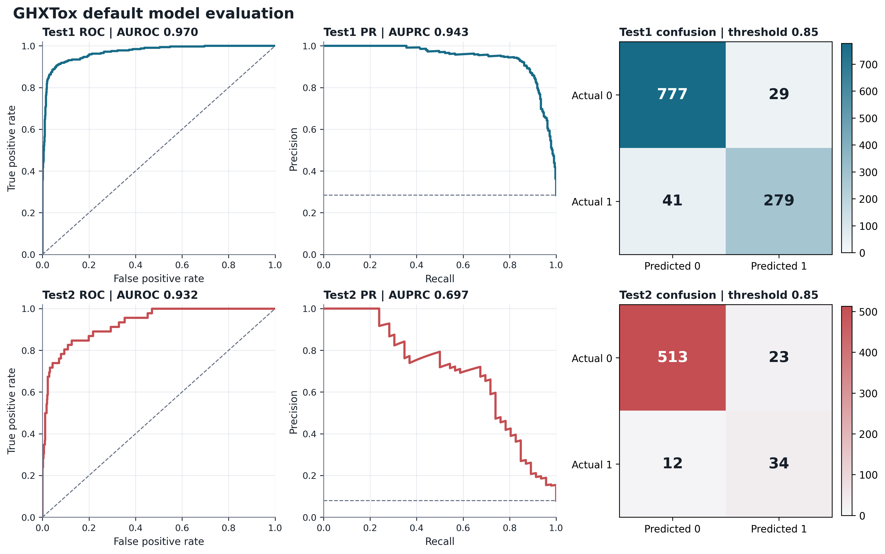

# GHXTox Final Results

## Frozen Default Model

The frozen default is ESM2-650M residue embeddings plus ESMFold C-alpha geometry, a PLDDT-aware spatial branch, and learned-confidence fusion.

- Checkpoint: `runs/plm_fusion_esm2_geometry_confidence/best_model.pt`
- Config: `configs/default.json`
- Seed: 42
- Checkpoint selection: validation MCC
- Decision threshold: 0.85
- Test sets were not used for checkpoint or threshold selection

| Dataset | N | Positive | Accuracy | BACC | Precision | Recall | F1 | MCC | AUROC | AUPRC |
| --- | ---: | ---: | ---: | ---: | ---: | ---: | ---: | ---: | ---: | ---: |
| Test1 | 1126 | 320 | 0.9378 | 0.9179 | 0.9058 | 0.8719 | 0.8885 | 0.8458 | 0.9699 | 0.9426 |
| Test2 | 582 | 46 | 0.9399 | 0.8481 | 0.5965 | 0.7391 | 0.6602 | 0.6320 | 0.9316 | 0.6969 |

Confusion matrices at threshold 0.85:

| Dataset | TN | FP | FN | TP |
| --- | ---: | ---: | ---: | ---: |
| Test1 | 777 | 29 | 41 | 279 |
| Test2 | 513 | 23 | 12 | 34 |

The vector version is `reports/figures/default_model_evaluation.pdf`; raw ROC and PR points are stored beside it.

## Multi-Seed Reproducibility

The default architecture was trained with seeds 42, 123, and 2025. Every run used the same fixed threshold 0.85. Values are mean +/- sample standard deviation.

| Dataset | Accuracy | BACC | F1 | MCC | AUROC | AUPRC |
| --- | ---: | ---: | ---: | ---: | ---: | ---: |
| Test1 | 0.9278 +/- 0.0107 | 0.8999 +/- 0.0174 | 0.8678 +/- 0.0213 | 0.8195 +/- 0.0276 | 0.9669 +/- 0.0027 | 0.9336 +/- 0.0079 |
| Test2 | 0.9341 +/- 0.0060 | 0.8086 +/- 0.0349 | 0.6119 +/- 0.0449 | 0.5782 +/- 0.0499 | 0.9225 +/- 0.0099 | 0.6356 +/- 0.0557 |

Test2 contains only 46 positive peptides, and its decision metrics show meaningful seed variance. The seed-42 result is the frozen single-run result, while the three-seed mean is the more conservative expected result.

## Bootstrap Confidence Intervals

Five thousand class-stratified hierarchical bootstrap iterations were used. Each replicate samples a model seed and then resamples positive and negative test examples separately.

| Dataset | MCC (95% CI) | F1 (95% CI) | AUROC (95% CI) | AUPRC (95% CI) |
| --- | --- | --- | --- | --- |
| Test1 | 0.8195 [0.7611, 0.8703] | 0.8678 [0.8239, 0.9063] | 0.9669 [0.9551, 0.9774] | 0.9336 [0.9078, 0.9557] |
| Test2 | 0.5782 [0.4419, 0.7109] | 0.6119 [0.4854, 0.7312] | 0.9225 [0.8766, 0.9599] | 0.6356 [0.4842, 0.7885] |

## Core Ablations

The table uses each experiment's documented, validation-selected protocol. Thresholds are shown because not every historical branch used 0.85.

| Experiment | Threshold | Test1 MCC | Test1 AUPRC | Test2 F1 | Test2 MCC | Test2 AUPRC | Decision |
| --- | ---: | ---: | ---: | ---: | ---: | ---: | --- |
| Default learned-confidence fusion | 0.85 | 0.8458 | 0.9426 | 0.6602 | 0.6320 | 0.6969 | Retained default |
| ESM2 sequence-only | 0.85 | 0.8177 | 0.9367 | 0.6038 | 0.5709 | 0.7077 | Strong single branch; lower decision metrics |
| ProtT5 fusion | 0.85 | 0.8234 | 0.9426 | 0.6038 | 0.5709 | 0.6953 | ESM2 retained |
| Supervised contrastive loss | 0.85 | 0.8143 | 0.9303 | 0.6038 | 0.5709 | 0.6427 | Rejected |
| Focal BCE | 0.85 | 0.8159 | 0.9419 | 0.6471 | 0.6171 | 0.7273 | Ranking-oriented auxiliary result |
| Chemical structure features | 0.85 | 0.8037 | 0.9398 | 0.6383 | 0.6067 | 0.7243 | Ranking-oriented auxiliary result |
| ESM2 + atom-graph cross-attention | 0.25 | 0.8297 | 0.9311 | 0.6429 | 0.6183 | 0.6622 | Best atom-graph branch; below default |
| Small atom residual on default 3D | 0.43 | 0.8241 | 0.9339 | 0.6018 | 0.5728 | 0.6339 | Rejected |
| C-alpha local-frame geometry | 0.50 | 0.7953 | 0.9265 | 0.5200 | 0.4770 | 0.6440 | Rejected |
| Full-backbone geometry | 0.85 | 0.7626 | 0.9225 | 0.5814 | 0.5497 | 0.6641 | Rejected |
| High-pLDDT-only training | 0.85 | 0.7232 | 0.8925 | 0.5854 | 0.5593 | 0.5923 | Rejected |

No tested architecture exceeded the default model on the adoption criterion of test2 MCC while preserving F1.

## Structure-Quality Analysis

The frozen default model performs better on samples with mean pLDDT >= 0.70:

| Evaluation subset | N | F1 | MCC | AUROC | AUPRC |
| --- | ---: | ---: | ---: | ---: | ---: |
| Test1 full | 1126 | 0.8885 | 0.8458 | 0.9699 | 0.9426 |
| Test1 high-pLDDT | 671 | 0.9146 | 0.8878 | 0.9807 | 0.9633 |
| Test2 full | 582 | 0.6602 | 0.6320 | 0.9316 | 0.6969 |
| Test2 high-pLDDT | 333 | 0.7368 | 0.7221 | 0.9575 | 0.8022 |

Filtering training data to high-pLDDT samples reduced full-test performance, so confidence is used for analysis and dynamic fusion rather than hard training exclusion.

## CD-HIT 0.80 Protocol

Native CD-HIT 4.8.1 reduced training data from 6387 to 5183 representatives. Corrected train+test combined clustering produced strict sets of 771 test1 peptides and 425 test2 peptides.

| Model | Evaluation set | F1 | MCC | AUROC | AUPRC |
| --- | --- | ---: | ---: | ---: | ---: |
| Full-data default | Test1 strict | 0.8456 | 0.7925 | 0.9543 | 0.9064 |
| CD-HIT 0.80 retrained | Test1 strict | 0.8118 | 0.7562 | 0.9454 | 0.8852 |
| Full-data default | Test2 strict | 0.6279 | 0.5941 | 0.9274 | 0.6606 |
| CD-HIT 0.80 retrained | Test2 strict | 0.5278 | 0.4843 | 0.8950 | 0.5421 |

The full-data model remains stronger on identical strict subsets. CD-HIT retraining is retained as a protocol-alignment experiment and does not replace the default.

## Reporting Guidance

- Use the three-seed mean +/- standard deviation as the primary reproducibility result.
- Show the frozen seed-42 result as the selected single-run checkpoint, not as the expected performance of every run.
- Report AUROC and AUPRC together with MCC/F1 because test2 is highly imbalanced.
- Include bootstrap intervals and CD-HIT strict results when comparing against papers with redundancy-controlled protocols.
- Do not claim direct superiority over published models unless datasets and split protocols are identical.

Detailed supporting reports:

- `MULTISEED_RESULTS.md`
- `BOOTSTRAP_RESULTS.md`
- `SEQUENCE_SIMILARITY_RESULTS.md`

